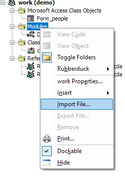
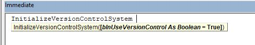
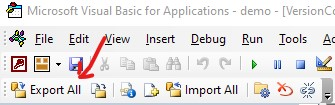
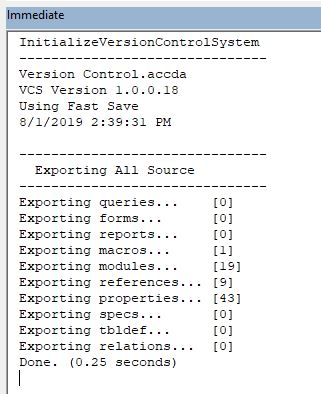

msaccess-vcs-integration
========================

About
-----

Easily export your Microsoft Access Database objects for use with a version control system like **GitHub** or **GitLab**. (Allows you to easily track code changes over time.)

Note that this branch has taken **a significantly different direction** from the original (and primary) project maintained at <https://github.com/timabell/msaccess-vcs-integration>.

This project works as a **Microsoft Access add-in**, loaded on demand from the VBE IDE, and is designed to work with ADP projects as well as the main accdb format. This project is under development for internal use, but I will try to push updates to GitHub as I am able.

Another key difference with this project is that my focus has been strictly on the *export* of database objects into a version control system like GitHub or GitLab for the purpose of tracking changes to a project over time.

This project also supports **Microsoft Access ADP projects**, a now-deprecated flavor of an Access database that integrates more tightly with SQL Server. A few of us still support such projects, and this tool makes that job easier.  :-) 

Installation
------------

To use this project, you will need the following two things:
 1. Copy this add-in file (**Version Control.accda**) into the same folder as your Microsoft Access database.
 2. Then, copy or import **`modVersionControl`** module from `Version Control.accda` into the database you want to track. The defaults should work right out of the box, but you can see below for more advanced usage.
 
 

 Basic Usage
 -----------
 To use this add-in, simply type `InitializeVersionControl` from the VBA immediate window. (Ctl+space is a great auto-completion shortcut to use with this.)
 
 

 
 This will load a toolbar with a button to **Export All**. Click this button to export the source code and objects from the current database. 
 


You will then see some text output in your immediate window as the tool exports the database objects. (See advanced options if you want to see each object listed as it is exported.) You will see the number of each type of object, as well as the total time it took to run.




Advanced Options
----------------

The basic concept here is that the `modVersionControl` module is a loader that loads the MSAccessVCS library into the current project as a referenced library add-in. If you don't want it loaded all the time, you can run `InitializeVersionControl False` to unload the add-in module after you are finished.

### VCS Settings

Inside `modVersionControl`, you will see a number of options that you can customize for your needs. The names are pretty self-explanatory, but here is a little more description on what they do:

 * **System** - I primarily use GitHub, (which also works for GitLab) but there is some support for TortoiseSVN, which I have used in the past.
 * **Export Folder** - I like to keep this relative to the project, but it can be customized here.
 * **Show Debug** - Show more verbose messages while running.
 * **Include VBE** - Access objects are always exported, and include the VBA code. This option gives you the ability to also export the VBE objects, which can be helpful if you are dragging and dropping these files to other projects, or importing as VBE objects.
 * **Fast Save** - Major performance gain with small changes to large projects. This attempts to only export the objects that have changed since the last export. This especially helps to not have to export forms and reports if they have not changed.
 * **Save Print Vars** - Saves a copy of the print variables, such as custom printer settings used in reports.
 * **Save Query SQL** - In addition to the Access object, this option exports a copy of just the SQL code from queries. I find this much more readable than the source of the Access Object when reviewing what I actually changed on the SQL side. (The Access object includes other information relating to the layout of the query designer.)
 * **Save Table SQL** - In addition to the Access object, this creates a SQL statement like what you would use to create the table. Here again I find this easier to see at a glance what changed in the actual structure of the table between versions.
 * **Save Table** - Includes a copy of the table data in the export. Normally you are just exporting the object definitions, but in some cases you may want data from some of the tables as well. Repeat this option for each table for which you want to save data.
    
```vb    '---------------------------------------------------------------------------------------
' Procedure : InitializeVersionControlSystem
' Author    : Adam Waller
' Date      : 1/29/2019
' Purpose   : Call this function to activate or deactivate version control.
'           : Add a copy of this module to the local project to serve as the
'           : loader/unloader of the referenced VCS library.
'---------------------------------------------------------------------------------------
'
Public Sub InitializeVersionControlSystem(Optional blnUseVersionControl As Boolean = True)

    '//////////////////////////////////////////////////////////
    ' SET THESE VALUES AS NEEDED FOR YOUR ENVIRONMENT
    '//////////////////////////////////////////////////////////
    
    ' Version Control Library
    Const cstrLibraryPath As String = "\"
    Const cstrLibraryFile As String = "Version Control.accda"
    Const cstrLibraryName As String = "MSAccessVCS"
    
    ' VCS Settings for this database (Additional parameters may be added as needed)
    Dim colParams As New Collection
    With colParams
        .Add Array("System", "GitHub")  ' IMPORTANT: Set this first, before other settings.
        .Add Array("Export Folder", CurrentProject.Path & "\" & CurrentProject.Name & ".src\")
        ' Optional parameters
        .Add Array("Show Debug", False)
        .Add Array("Include VBE", False)
        .Add Array("Fast Save", True)
        .Add Array("Save Print Vars", False)
        .Add Array("Save Query SQL", True)
        .Add Array("Save Table SQL", True)
        '.Add Array("Save Table", "vObjectPermissions")
    End With

    ' Make sure we are in the current project, not a library database.
    If CurrentProject.FullName <> CodeProject.FullName Then
        ' Call the function in the current project instead.
        Debug.Print "Please run this command from " & CurrentProject.Name
    Else
        ' Pass the parameters to the wrapper function
        LoadVersionControl blnUseVersionControl, cstrLibraryPath, cstrLibraryFile, cstrLibraryName, colParams
    End If

End Sub
```

### Automatic Loading

To load this library automatically when your database opens, include the following line in your startup code:

`InitializeVersionControlSystem`

### Renaming Loader Module

You are free to rename the loader module to whatever you like to conform to your project's naming convention. (I.e. you might prefer `basVersionControl` instead of `modVersionControl`)