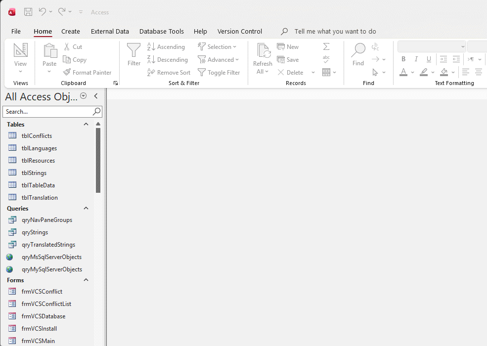

Version Control Add-in (msaccess-vcs-addin)
======================
*for Microsoft Access Database Development*
----------
Supports Microsoft Access 2010, 2013, 2016, 2019, and 365

About
-----

Easily export your Microsoft Access Database objects for use with a version control system like **GitHub** or **GitLab**. Track design changes over time and collaborate with other developers on the same project.

This project is a **Microsoft Access add-in** with a **ribbon toolbar** (32- and 64-bit via twinBASIC COM) to export, build, and merge database objects as text source files.

**Version 5** highlights: deterministic query export (`.sql` + `.json`), export format 5.0 file extensions, binary fast-save index, merge build, `.env` connection handling, optional MCP agent automation (off by default). See the wiki [Version 5 Overview](https://github.com/joyfullservice/msaccess-vcs-addin/wiki/Version-5-Overview).

Development Focus
-----------------
This add-in targets complex Access applications (hundreds of objects) with emphasis on:

* **Intuitive UI** — Options dialog, ribbon, conflict resolution (not only Immediate Window commands).
* **Ribbon toolbar** — 64-bit COM wrapper ([twinBASIC](https://twinbasic.com/)) calling into the `.accda` add-in.
* **Performance** — Fast Save with `vcs-index.idx`; typical incremental exports complete in seconds.
* **Broad object support** — Forms, reports, queries, modules, table data, themes, ADP/SQL schema snapshots, and more. See [Supported Objects](https://github.com/joyfullservice/msaccess-vcs-addin/wiki/Supported-Objects).
* **Build and merge** — Full build from source or [merge build](https://github.com/joyfullservice/msaccess-vcs-addin/wiki/Merge-Build) into an existing database.
* **Integrated automated testing** — Built-in test runner you can use in your own database (`TestAssert`, **Run Tests** from the ribbon, tag/filter support, and JSON results), plus the add-in's own layered tests and query round-trip fixtures. See [Testing](https://github.com/joyfullservice/msaccess-vcs-addin/wiki/Testing) on the wiki.
* **AI-assisted development** — Agent-friendly text source plus `AGENTS.md`/`CLAUDE.md` guides and an optional [MCP server](https://github.com/joyfullservice/msaccess-vcs-addin/wiki/MCP-and-Automation) (off by default) so AI coding agents can export, import, and run tests safely.
* **ADP projects** — Export server-side SQL object definitions where still maintained.

Getting Started
---------
Download the add-in from [**Releases**](https://github.com/joyfullservice/msaccess-vcs-addin/releases) and run `Version Control.accda` to install. See the [project wiki](https://github.com/joyfullservice/msaccess-vcs-addin/wiki) for installation, options, and migration guides.

[Quick Start](https://github.com/joyfullservice/msaccess-vcs-addin/wiki/Quick-Start) — install, export, and build in under five minutes.

Contributing
------------
[Issues](https://github.com/joyfullservice/msaccess-vcs-addin/issues) and [pull requests](https://github.com/joyfullservice/msaccess-vcs-addin/pulls) are welcome. See [CONTRIBUTING.md](/CONTRIBUTING.md) and the wiki [Editing and Contributing](https://github.com/joyfullservice/msaccess-vcs-addin/wiki/Editing-and-Contributing) page.

Development Roadmap
-------------------
Ongoing work (not an exhaustive promise list):

* **Version 5.x** — Export format 5.0, query pipeline, binary index, MCP API (shipped; see wiki).
* **Translations** — Partial UI localization (English, Brazilian Portuguese); more locales welcome ([Translation](https://github.com/joyfullservice/msaccess-vcs-addin/wiki/Translation)).
* **Round-trip testing** — Query regression corpus and harness **live**; expanding to forms, reports, modules ([Regression Testing](https://github.com/joyfullservice/msaccess-vcs-addin/wiki/Regression-Testing)).
* **CI/CD integration** — Community-driven patterns via `VCS` API and GitHub Actions; full hosted pipeline out of scope for the add-in itself ([issue #51](https://github.com/joyfullservice/msaccess-vcs-addin/issues/51)).

Project History
----------------
Forked from [timabell/msaccess-vcs-integration](https://github.com/timabell/msaccess-vcs-integration) in 2015; extensively rewritten. Detached as a standalone project in 2023. Repository: [joyfullservice/msaccess-vcs-addin](https://github.com/joyfullservice/msaccess-vcs-addin).
