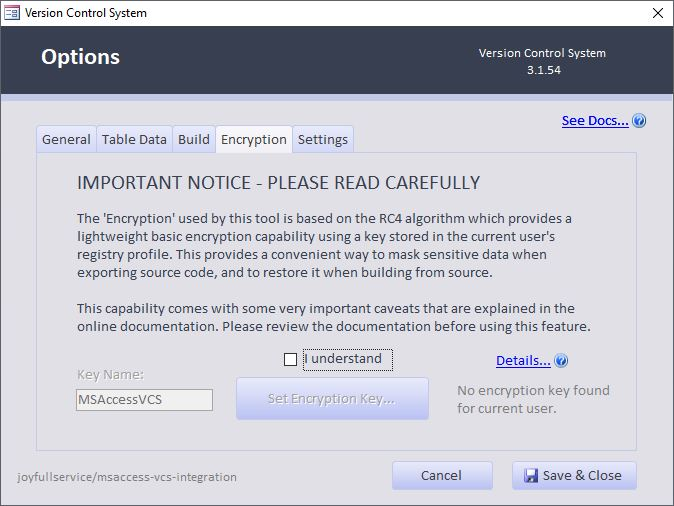

# *PLEASE NOTE - This feature has been DISCONTINUED

The section below is left in case you need to DECRYPT your source files while building. 

The add-on no longer supports encryption of certain items (such as file paths) within source files. [See this Issue for details.](https://github.com/joyfullservice/msaccess-vcs-integration/issues/193)

**If you need to encrypt your project, you should use another method such as full-directory encryption to ensure your entire source code is protected.**

If you have source code that contains encrypted items created from a previous version of this add-in, and you need to build the project from source, you can download [Release Version 3.3.1](https://github.com/joyfullservice/msaccess-vcs-integration/releases/tag/v3.3.1); this is the last version which supports building from a (partially) encrypted code base. 

Once you build your project from the encrypted source, you should set the `Security` to none remove the encryption from your project and export again. This page and related code items will be retired in **March 2022**.

Note, this only affects projects where you do not have a working copy of the Microsoft Access database project itself. If you have a working project, you can simply upgrade the add-in and export source to continue on your way. Going forward, no items will be "encrypted" in the source code, and it will be your responsibility as a developer to ensure that sensitive information is not published publicly.

## Legacy Documentation Below

 * **I Understand** - Acknowledge that you have read the disclaimer, and and would like to set the encryption key.
 
 * **Key Name** - This is the name used to reference the encryption key that is stored in the registry. When multiple users are working on the same system, the can set the same key and name, and be able to decrypt the encrypted paths and other content when building the application from their respective computers.

# Encrypting Sensitive Data - DISCONTINUED

This tool includes some very basic encryption tools to optionally mask sensitive data before exporting it. While this is probably very adequate in most development scenarios, I want to point out some very important notes.

## Please Understand

* This is not suitable for **highly sensitive data** like _passwords_, _credit card information_, _social security numbers_, _medical records_, etc... That kind of data should not be stored in version control, and probably shouldn't be stored in Microsoft Access either, if you want my opinion on the matter. 😄 
* **Do not use an existing password** or sensitive information as the key. It is stored in plain text and can be easily read from the registry or using source code in this add-in. I recommend using a [password generator](https://www.lastpass.com/password-generator) and storing a copy in a safe place.
* You need to determine if this is sufficient to protect PII (personally identifiable information) that you may be exporting out of your database. (Particularly when saving table data.) You are responsible for compliance with all applicable laws in this regard.
* If your key is reset or lost, it cannot be recovered by the program, nor can encrypted data be decrypted without it. If you lose or change the key, simply export the data again after setting the new key.

## How it works

A private key is stored in the registry for the current user. Encrypted data is processed using a VBA implementation of [RC4](https://en.wikipedia.org/wiki/RC4) to hash the data using the key. The key is not exported or stored anywhere with the project. Any user needing to decrypt the data will need to set the same key in the options dialog.

## Multi-user usage

Multiple developers can still work on the same project using different computers and user profiles as long as they use the same encryption key when exporting or importing source.