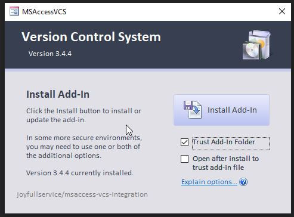

# Install
 1. Download `Version.Control.zip` from the [Releases](https://github.com/joyfullservice/msaccess-vcs-integration/releases) page.
 2. Extract `Version Control.accda`.
 3. Run the `Version Control.accda` file.
 4. Choose Install Options (Below).
 5. Click [Install Add-In].

## Install Options
*NOTE:* None of these are required; they allow for easier installation/use. 
* **Trust Add-In Folder (Default ON)** During installation, the VCS Addin Folder will be trusted in Access/Office. This allows Access to load the Add-In correctly in some protected setups, and will enable faster loading in others.

* **Open after install to trust add-in file (Default OFF)** In some protected computing environments (Government, Banking, Other Secure Environments), the Add-In must be opened from the installed folder to be properly trusted.

# Uninstall
[Click here for Uninstall Instructions](https://github.com/joyfullservice/msaccess-vcs-integration/wiki/Options#uninstalling)