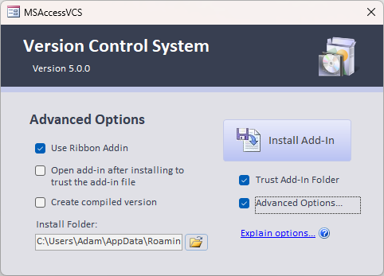

# Install

1. Download the [latest **Version_Control_vX.X.X.zip**](https://github.com/joyfullservice/msaccess-vcs-addin/releases/latest).
2. Extract `Version Control.accda` from the zip archive.
3. Remove "Mark of the Web" (MOTW) if Windows blocks the file. See [this blog post](https://nolongerset.com/install-vcs-addin/). MOTW is not always set (for example when extracting with 7-Zip).
4. *(Optional)* Adjust install options (below).
5. Click **Install Add-In**.

## Install Options

None of these are required for basic use; they help locked-down environments.

| Setting | Default | Description |
|---------|---------|-------------|
| **Trust Add-In Folder** | On | Adds the install folder as a trusted location (`%AppData%\Roaming\MSAccessVCS\` by default). |
| **Advanced Options** | Off | Ribbon, trust-on-open, custom install path. |

| Setting | Default | Description |
|---------|---------|-------------|
| **Use Ribbon Addin** | On | Installs the twinBASIC COM ribbon add-in (32- and 64-bit DLLs). Provides **Export**, **Build**, **Merge**, **Options**, **Run Tests**, and related commands. Turn off only if COM add-ins are blocked; use **Database Tools** → **Add-Ins** → **VCS** menu items instead. |
| **Open add-in after installing to trust the add-in file** | Off | Opens the `.accda` after install so you can trust it in strict environments. |
| **Install Folder** | `%AppData%\Roaming\MSAccessVCS\` | Custom path if policy requires it. **Uninstall completely before changing** the install folder. |

## Ribbon (Version 4+)

The ribbon is a lightweight COM add-in (`MSAccessVCSLib_win32.dll` / `MSAccessVCSLib_win64.dll`) that calls into `Version Control.accda`. It loads when Access starts if installation succeeded and COM add-ins are enabled in Trust Center.

If the ribbon does not appear:

- Confirm **Use Ribbon Addin** was on during install.
- Check **File** → **Options** → **Trust Center** → **COM Add-ins**.
- Re-run the installer or use **Options** → **Settings** → **Open Install Folder** to verify DLLs are present.

## Rebuild add-in from source (developers)

Contributors building the add-in from `Version Control.accda.src` can use **Rebuild Add-In** on the ribbon (or `VCS.RebuildAddIn` in code) after a local build. See [Editing and Contributing](Editing-and-Contributing).

## Uninstall

[Uninstall instructions](Options#remove-add-in) — **Options** → **Settings** → **Uninstall**, or the wiki Options page under **Remove Add-In**.
