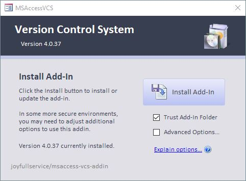
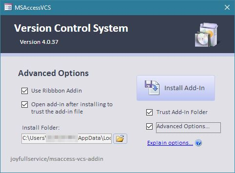

# Install
 1. Download the [latest **Version_Control_vX.X.X.zip**](https://github.com/joyfullservice/msaccess-vcs-integration/releases/latest).
 2. Extract `Version Control.accda` from the zip archive.
 3. *(Optional)* Adjust install options (see below).
 4. Click **Install Add-In**.

## Install Options
*NOTE:* None of these are required to use the add-in, but they are designed to allow for easier installation and use.

|Setting  |**Default** 
 *(Setting)*|Description
|-|:-:|:-
|**Trust Add-In Folder**|**Default: On**|During installation, the VCS Addin install folder will be added as a trusted location in Microsoft Access/Office. This allows Access to load the Add-In correctly in some protected setups, and will enable faster loading in others. The default install location is `C:\Users\%username%\AppData\Roaming\MSAccessVCS\`
|**Advanced Options**|**Default: Off**|In some protected computing environments you may need to select additional options. See below for more details.

|Setting  |**Default** 
 *(Setting)*|Description
|-|:-:|:-
|**Use Ribbon Addin**|**Default: On**|With Version 4 and up the addin and most features can be directly launched with a custom ribbon. 
||_On_|Install the ribbon and load to Access's ribbon. The ribbon will automatically load when Access loads, making launching version control much simpler.
||_Off_|Do not install the Ribbon. You can still load the Addin after installation by going to [Database Tools]>[Add-Ins]>[VCS Open] or [VCS Export All Source].
|**Open add-in after installing to trust the add-in file**|**Default: Off**|In some protected computing environments (I.e. Government, Banking), the Add-In must be opened from the install location to be properly trusted. This option will open the add-in file immediately after install, and give you the opportunity to trust the file.
|**Install Folder**||By default, the addin will be installed to `C:\Users\%username%\AppData\Roaming\MSAccessVCS\`. If you need to select an alternate location for installation due to your development environment, security settings, etc., you can change the installation Folder. 
 **WARNING: You MUST _completely uninstall_ the Addin prior to changing the installation folder. Failure to do this may lead to unexpected issues and difficulty removing the addin.**

# Uninstall
[Click here for Uninstall Instructions](<Options#Remove Add-In>)