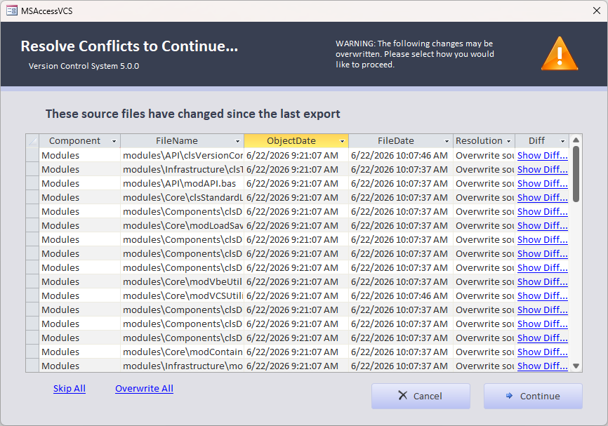

What exactly is a ***merge build***? Essentially, it is a fast-running partial import that ensures that the current working database has been updated to match the set of source files. 

If nothing has changed in the source files, this only involves a quick scan. If some of the items have been updated on the source file side, only those items will be updated in the database.

Keep in mind that your database exports should be fairly current to effectively use the merge build functionality. If you have database objects that have been modified in the database, but not exported to source, you may encounter conflicts if you attempt to update these objects from source.

## Example Workflow:
1. Make changes to database objects (application development)
1. Export source files
1. Update source files (i.e. switch branches, pull commits, etc...)
1. Run Merge Build to bring the source file changes into the project

# Intended Use Cases
This feature is primarily intended for larger/complex databases where a full build might be much slower, or where some external resources may not be available in the development environment.

**Multi-user development** - If multiple users are working on different parts of the same database, this is a great way to pull in changes from other developers without having to do a full build.

**Testing/Switching Branches** - This is also a faster way to test out slight variations in sets of source files. For example, you might build from the main branch, then switch to a feature branch, and use a merge build to get your database updated to the feature branch. When your review/testing is finished, you can switch back to the main branch and again run a merge build to update your database to match the main branch source files.

# Expected Behavior
|Source File|Database Object|Resulting Action |
|-----------|---------------|-----------------|
|Unchanged  |Unchanged      |None             |
|Unchanged  |Modified       |None             |
|New        |Missing        |Import           |
|Modified   |Unchanged      |Import           |
|Missing    |Unchanged      |Delete           |
|Modified   |Modified       |Conflict (Import)|
|Missing    |Modified       |Conflict (Delete)|

# Additional Notes
For the merge build functionality to work correctly, it is very important that the `vcs-index.idx` file be paired with the (binary) database file and *not* committed to version control. The recommended (and default) setup is that the binary database file and index file are excluded from version control.

While a merge build is a very helpful development tool, a *full build* is the most robust way to ensure that a database project fully reflects the source files. A full build is recommended for final testing and deployment.

Like full builds, each merge build makes a backup copy of the current database before applying changes to the database. If something goes wrong in the merge, you can always rename this backup to the original file name to get back to where you started.

See issue [#81](https://github.com/joyfullservice/msaccess-vcs-addin/issues/81) for additional discussion that ultimately led to the implementation of this feature.

---

## Conflict resolution

When source and database both changed the same object, the add-in pauses for your decision:

| Resolution | Effect |
|------------|--------|
| **Skip** | Leave the database object unchanged |
| **Overwrite** | Import from source (source wins) |
| **Delete** | Remove the database object (when source file was deleted) |

For multi-file objects (queries with `.sql` and `.json`, split forms with `.form` and `.cls`), the conflict UI can show **per-file diffs** so you see which side changed which file.

**Options** → **Build** also provides **Run Sub Before Merge** / **Run Sub After Merge** hooks and **Immediately export object after merge** to re-export merged objects in one step.

Agent/MCP sessions may auto-resolve conflicts when automation is enabled — see [MCP and Automation](MCP-and-Automation).

---

## Index and Git

- Keep `vcs-index.idx` next to the database file; **do not commit** it (default `.gitignore`).
- Commit only the `.src` tree and `vcs-options.json`.
- After a full build, run **Export** once so the index matches the database — reduces false conflicts.

---

## Related

- [Documentation](Documentation) — collaborative workflow
- [Options](Options) — merge hooks
- [FAQs](FAQs) — merge vs full build