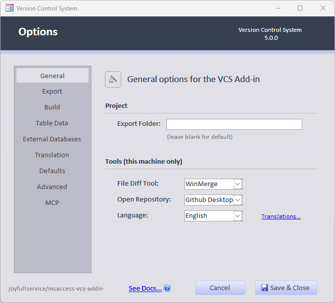

Click **Options** to open the **Options** dialog. Settings are stored in `vcs-options.json` in your export folder (`.src` by default). The dialog uses a **left navigation** list: General, Export, Build, Table Data, Databases, MCP, Translation, Advanced, and Defaults (Settings).

Machine-only preferences (diff tool, install folder) are stored in the registry, not in `vcs-options.json`.

The screenshot below shows the **General** section as a representative example of the dialog layout. The other sections follow the same left-navigation layout and are documented in the tables below.

## General

|Setting  |**Default** 
 *(Setting)*|Description
|-|:-:|:-
|**Export Folder** |**Default: [Blank]**|Blank uses `\[database].src` beside the database. Relative paths start with `\`. Absolute paths and `%dbName%` placeholders are supported. See [issue #139](https://github.com/joyfullservice/msaccess-vcs-addin/issues/139).
|**Developer Settings**||_Note:_ Items below are local-only (registry), not saved in `vcs-options.json`.
|File Diff Tool|**Default: WinMerge**|Select the diff tool used by git.
||_WinMerge_
||_VSCode_
||_TortoiseGitDiff_
|**Open Repository**|**Default: 
 [Blank]**|Select the tool you want to use to open the repository for git integration.
||_[Blank]_
||_Github Desktop_
||_VSCode_
||_SourceTree_
||_Tortoise Git_
|**Language**|**Default: English**|Select the language used by the AddIn. 
NOTE: Not all screens or prompts have been updated to use translation. When not updated, the text will display in **English**.
 See [Translation](Translation) for more details.
||English (Localization Testing)|Used when performing localization tests.
||English
||Brazilian Portuguese
|**Translations...**||Opens the Translation section. See [Translation](Translation).

## Export

Note: export options control what is written to source files. Import applies what is already in those files regardless of current UI settings. **Export Folder** is under General.

|Setting  |**Default** 
 *(Setting)*|Description
|-|:-:|:-
|**Export Format**|**Default: 5.0.0 (latest)**|Gates export layout and behavior. See [Version 5 Overview](Version-5-Overview). Import accepts older export formats.
|**Use Fast Save**|**Default: On**|Major performance gain with small changes to large projects. This attempts to only export the objects that have changed since the last export. This especially helps to not have to export forms and reports if they have not changed.
|**Extract Theme Files**|**Default: Off**|Extract the contents of the `*.thmx` files. Microsoft Office Theme files `*.thmx` are actually zip files containing XML and other files that define the specifics of a theme. You can use Theme Files for form style and color consistency. If you are customizing a theme, you may wish to extract these files so your changes can be tracked in Version Control. 
 **_Note:_** _Extracting Theme files may create noise in your database due to slight variations in rendering machine to machine._
|**Sanitize Level**|**Default: Standard**|Set level for sanitize routines to remove noise. Sanitizing allows you to remove noise from your exported files. Turn off to export raw file outputs. Sanitization routines are checked to ensure most do not affect building of exported files.
||*None (Off)* | Turn off sanitization, export raw files. These may not import properly, but they may be useful when trying to troubleshoot. 
_**Note:** Files will still be converted to UTF-8 or System Codepage encoding depending on Access Version in this mode._ 
**_NOTE:_ If you set Sanitize level to "*None (Off)*", none of the Sanitize Options will be used.**
||*Minimal*| Only basic sanitization to ensure reliable rebuilding of files.
|| *Standard*| Remove most exported noise (GUIDs, the like). Removes object GUIDs, name maps, and other data that changes from build to build. (These values are recreated automatically when importing source files.) From a development perspective, these are more like binary artifacts that just add noise to the version control commits, reducing clarity on actual code changes.
||*Extended*|Remove as much as possible. This may lead to unexpected changes upon rebuilding. Features that are still in testing or confirmed to be temperamental may be introduced here prior to being implemented. **_User beware!_**

|**Sanitize Colors**|**Default: Minimal**|Removes color exports on forms where themes are used, or other situations where the color can be correctly set upon rebuild. These colors export differently in different machines, or different settings and are largely noise. 
 ***NOTE:* The most aggressive options may lead to unexpected color changes on forms!**
|**Save Printer Settings**|**Default: On**|Saves a copy of the print configuration for reports and forms. This is especially useful when you are using specific printer settings. The output is stored in human-readable json. By default, page orientation and paper size are saved with each report, but additional options are also available in the advanced printer options sub-dialog.
 |**Save Query SQL**|**Default: On**|In addition to the Access object, this option exports a copy of just the SQL code from queries. I find this much more readable than the source of the Access Object when reviewing what I actually changed on the SQL side. (The Access object includes other information relating to the layout of the query designer.)
|**Save Table SQL**|**Default: On**|In addition to the Access object, this creates a SQL statement like what you would use to create the table. Here again I find this easier to see at a glance what changed in the actual structure of the table between versions.
|**Format SQL**|**Default: On**|Format SQL for tables and queries where applicable. See [Issue #426](https://github.com/joyfullservice/msaccess-vcs-addin/issues/426).
|**Use Deterministic Query Export**|**Default: On**|Export queries as `.sql` + `.json` pairs (recommended). When off, legacy `.qdef`-style export may be used for compatibility. See [Query Source Files](Query-Source-Files).
|**Use .env For Connection Strings**|**Default: Auto**|Replace connection strings in exported files with `env:conn_*` references. See [Connections](Connections).
|**Split Layout from VBA**|**Default: On**|Split forms and reports into layout + code-behind. See [Split Files](Split-Files).
||_On_|Layout in `.form` / `.report` (format 5.0) or `.bas` (older format); code in `.cls`.
||_Off_|Single combined export file per object.
|**Run Sub Before Export**|**Default: [Blank]**|Run a VBA subroutine before exporting the source code. This can be used to clean up temporary data, mask sensitive information, or anything else you want to do. This will be called using  `Application.Run`.
|**Run Sub After Export**|**Default: [Blank]**|Similar to the option above, this allows you to specify a VBA subroutine to run *after* exporting the source code.

## Databases (External)

The Databases Tab allows you to use this tool to export externally backend connected databases from MySQL or Microsoft SQL Server (MSSQL). This can allow new developers without other version control tools to track changes on the backend and "sync" them to front end tools.

This tool is limited, and does not have the full featured tools of other Database tools such as SSMS.

**This is an _EXPORT ONLY_ feature: this will not send data to your database.**

*This tool only provides a 'quick export' fuction due to the significant time required to perform the SQL export. To perform a full export, delete the `\Databases\` folder in your VCS folder. Changes are tracked in the index, so you shouldn't miss anything.

|Setting  |**Default** 
 *(Setting)*|Description
|-|:-:|:-
|**Database List**||Lists database connections which will be exported by this tool. Double click on database connection to edit.
|**Delete**||Delete selected database connection.
|**Edit**||Edit selected database connection information.
|**Add**||Add a new database connection.

### Database External Connection Editing

|Setting  |**Default** 
 *(Setting)*|Description
|-|:-:|:-
|**Connection Name:**||Human readible name for the database connection. The Database Name is typical for this.
|**Enabled**|**Default: On**|Export this connection. If disabled, this connection is skipped (not exported) when running an export operation.
|**Use UTC Dates**|**Default: Off**|Use UTC Timestamps and dates when exporting SQL details. This can be very helpful when your developers are in disparate time zones.
|**Database Type:**|**Default: Microsoft SQL Server**|The backend server type for the external database.
||_Microsoft SQL Server_|Select this if your external database is hosted on a Microsoft SQL Server instance.
||_MySQL Server_|Select this if your external database is hosted on a MySQL Server instance.
|**Description:**||If you wish to provide additional context to the Connection Name, type it here. Examples might be "Production", or "Test", or "Staging1"
|**ADO (OLE) Connection String:**||The ADO (OLE) Connection string. This needs to be an OLE connection string as this tool is built on the ADODB functions. The examples which populate automatically are based on linked tables in your database, and are generally ODBC connection strings. If you have an MSSQL type database backend, this tool can attempt to create a compliant OLE connection string.
|**Save in .env file**|**Default: On**|Save the connection string (and passwords) in a `.env` file. 
**NOTE: ensure the `.env` files are excluded from version control if you have a password string.** See [Connections](Connections) for layered `.env` files via `APP_ENV`.
|**Attempt Conversion to ADO (OLE) String**|**Default: On**|Attempt to convert linked table string from ODBC to OLE.
|**Filter for database objects (source file paths):**||Use this to exclude objects from export. An example might be that you do not want the code for a login check to be exported, or you do not want some views exported.

## Table Data

The Table Data tab allows you to selectively include certain tables from which to include table ***data*** in version control. The *structure* of the tables is already being saved, but this gives you the additional option of saving the *data* itself.

The dialog box shows tables in the database. If the column does not show an option in *Export As* the data is not exported for that table. The example screenshot shows the tables in the Addin.

An example of where you might use this would be a table that defines options or settings in your database application. You might want to track when these settings change. Another example would be a `USysRibbons` table that defines the layout of a custom application ribbon. Note `USysRibbons` is stored by default.

The concept here is that you are selecting the table from which you want to save data, choosing the format to use, and clicking Update to save the changes.

**Note:** See [This FAQ](https://github.com/joyfullservice/msaccess-vcs-addin/wiki/FAQs#how-do-i-also-export-data-from-all-the-tables-in-my-database) for discussion on exporting all tables. Putting production data into version control may have significant PII/Cybersecurity/other consequences and is generally frowned upon.

|Setting  |**Default** 
 *(Setting)*|Description
|-|:-:|:-
|**Show Hidden**|**Default: Off**|List hidden tables in the current database.
|**Show System**|**Default: Off**|List system tables in the current database.
|**Show Other**|**Default: Off**|List table names that are saved in the options, but do not exist in the current database. You can also manually add table names to your `vcs-options.json` file. (Add a table through the interface first, and use the same syntax.)
|**Selected Table**||This highlights which table you have selected to set the export format. To add a table that is not listed, click the [*Other...*](#table-data) link.
|Selected Table: **<u>Other...</u>**||Click [*Other...*](#table-data) to enter a table name that doesn't exist in the database but you want to export if found.
|**Export As**|**Default: Tab Delimited**|Select the format to use for the exported data.
||*Tab Delimited*|Separate values with tab character. This is a good format to use when importing to Microsoft Excel, or reading the values in Version Control files.
||*XML Format* (Suggested)|Select this option for the most complete and robust representation of the data. It is harder to read in source files, but should import back in to accurate recreate the original data.
||*No Data* (BLANK) |Don't save data for this table.
|**Other Table Name**||Enter a table name to directly save output specification changes for the table. You should see the Save Data column update in the list of tables when you click the Update button. See [Issue 250](https://github.com/joyfullservice/msaccess-vcs-addin/issues/250) for additional discussion on this feature.
|**Export As**||Select the export format to export table.

### Default Tables
The following tables are added to the default list, but can be removed (if you desire...we strongly suggest you keep them).

   | Table Name   | Type | Explanation  
   |-|-|-
   | `USysRegInfo` |System | Stores registry information about Access (such as installed tooling). Exports as _Tab Delimited_.
   | `USysRibbons` |System | Stores custom ribbon information. Exports as _Tab Delimited_.

**NOTE:** The following tables should not be added to the export list, as they are already handled by this tool elsewhere.

   | Table Name   | Type | Explanation  
   |-|-|-
   | `MSysResources` |System | Images and Themes are exported in the `.\images\` and `.\themes\` folders, respectively.
   

   

## Build

A unique feature of this add-in is the ability to build a fully functioning database completely from source files. This allows multi-user development in a more typical development workflow where source files are exported and combined to build the end product.

|Setting  |**Default** 
 *(Setting)*|Description
|-|:-:|:-
|**Force import of original SQL for queries**|**Default: Off**|In some cases, such as when a query contains a subquery, _AND_ has been modified in the visual query designer, it may be imported incorrectly and unable to run. For these cases we have added an option to overwrite the .SQL property with the SQL that we saved separately during the export. See [issue #76](https://github.com/joyfullservice/msaccess-vcs-addin/issues/76) for further details.
|**Run Sub Before Build**|**Default: [Blank]**|Same as below, except before the build.
|**Run Sub After Build**|**Default: [Blank]**|Run the specified subroutine after building the project from source files. This is a great way to extend the add-in to add any custom post-build functionality that you need after the build finishes. For example, you might use this to trigger an automated testing routine that verifies that the application is fully functional.
|**Immediately export object after merge**|**Default: Off**|After a [merge build](Merge-Build), re-export merged objects so source and database stay aligned.
|**Run Sub Before Merge**|**Default: [Blank]**|VBA hook before merge build (`Application.Run`).
|**Run Sub After Merge**|**Default: [Blank]**|VBA hook after merge build.

## MCP

Agent automation permissions (all **Off** by default). Full security discussion: [MCP and Automation](MCP-and-Automation).

| Setting | Default | Description |
|---------|---------|-------------|
| **Allow Object Import from Source** | Off | Per-object import via MCP/API (`McpAllowImport`). |
| **Allow VBA Function Calls** | Off | Call existing public procedures by name. |
| **Allow Read-Only SQL Queries** | Off | `ExecuteSQL` for SELECT-only (`McpAllowExecuteSQL`). |
| **Allow Arbitrary VBA Execution** | Off | `RunVBA` / test runner (`McpAllowRunVBA`). |

## Advanced

| Setting | Default | Description |
|---------|---------|-------------|
| **Show Detailed Output** | Off | Verbose log during export/build. |
| **Debug VBA Errors** | Off | Break into VBA IDE on add-in errors (developers). |
| **Show Legacy Prompts** | On | Warn about obsolete VCS modules in consumer databases. |
| **Use short hashes in index** | On | 7-character hashes in `vcs-index.idx`. |
| **Hash Algorithm** | SHA256 | SHA256 or SHA512 (SHA1 discouraged). |
| **Use Git Integration** | Off | Open repo from ribbon; maintain `.gitignore` patterns. |
| **Default Test Filter** | [Blank] | Pre-fills **Run Tests** (module name, `@Tag`, or `-exclude`). See [Testing](Testing). |
| **Preserve RubberDuck ID** | Off | Keep Rubberduck annotation IDs in exports. |
| **Save Linked Table Definitions** | Off | Extra linked-table metadata export. |
| **Save All Document Properties** | Off | Export extended document container metadata. |

## Translation

See [Translation](Translation) for the Translation section and `.po` workflow.

## Settings (Defaults)
These affect your system at large; not just the currently open Access Project.

|Setting  |Description
|-|:-
|***System Defaults***
|**Save as Default**|Save the current options as default for new projects. Anytime you export source and a `vcs-options.json` file does not already exist, it will use the default options you have specified.
|**Restore Defaults**|In the current project (open database), restore options to default values based on saved system defaults.
|**Clear Defaults**|Reset options to default the settings specified in the add-in source code. If you click this button, then the **Save as Default** button, it will reset all user customizations to the default options.
|**Open Install Folder**|Opens the directory the Addin is installed in. See [Installation](Installation) for more information.
|***Remove Add-In***
|**Uninstall**|Uninstalls the add-in from your user profile, including all saved defaults and encryption keys. 
 [Click here for Install / Uninstall Instructions](Installation)