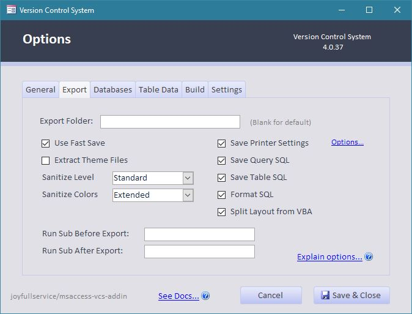
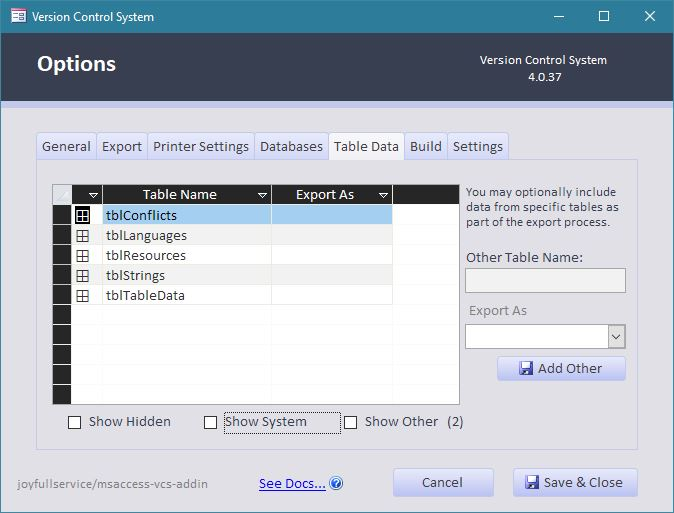

Click **Options** to open the **Options dialog**. Internally options are stored in a `vcs-options.json` file in the path of the exported source code. Options are loaded and used when exporting to source files, or when building a project from source.

## General Tab

|Setting  |**Default** 
 *(Setting)*|Description
|-|:-:|:-
|**Show Detailed Output**|**Default: Off**|Enable verbose output of each step; useful when you're real curious. This may slow down Export and Build operations.
|**Debug VBA Errors**|**Default: Off**|*(Advanced Users/Add-in Developers)* If an unexpected error occurs in the add-in code, stop and open the VBA IDE to do further debugging. This may be helpful when debugging a problem with the add-in, or reviewing an existing issue. *You should generally keep Off unless trying to find the source of a bug, or doing development work on the add-in.*
|**Show Legacy Prompts**|**Default: On**|If upgrading from the integrated version of this project, there may be legacy VCS modules left in your database project that are no longer needed. This will notify you if these legacy modules are found. If you would like to keep them in your project, you can clear this option to disable the notification.
|**Use short hashes in index**|**Default: On**|If on, `git` style hashes (first 7 characters) will be used in the file index. 
*NOTE: This was done to improve readability and reduce file size, but you can always uncheck this box if you want to store the full hash.*
|**Hash Algorithm**|**Default: SHA256**|Choose the hashing algorithm here. This may affect build time if you choose a more complex option. Hashes are used to help determine whether source files changed between import/export operations.
||~~*SHA1*~~|Use SHA-1 hashing algorithm. ([Not recommended](https://en.wikipedia.org/wiki/SHA-1). While hashing is not used for security purposes in this add-in, any usage of SHA1 is not allowed in some network environments.)
||*SHA256*|Use SHA-256 hashing algorithm.
||*SHA512*|Use SHA-512 hashing algorithm.
|**Developer Settings**||_Note:_ Developer Settings are local-only and are not saved in the settings config. They are set as a registry preference (same as install preferences).
|File Diff Tool|**Default: WinMerge**|Select the diff tool used by git.
||_WinMerge_
||_VSCode_
||_TortoiseGitDiff_
|**Open Repository**|**Default: 
 [Blank]**|Select the tool you want to use to open the repository for git integration.
||_[Blank]_
||_Github Desktop_
||_VSCode_
||_SourceTree_
||_Tortoise Git_
|**Language**|**Default: English**|Select the language used by the AddIn. 
NOTE: Not all screens or prompts have been updated to use translation. When not updated, the text will display in **English**.
 See [Translations Page](wiki/Translations) for more details.
||English (Localization Testing)|Used when performing localization tests.
||English
||Brazilian Portuguese
|[Translations...]()||Click the Translations... link to open the Translation Tab. See [Translation](wiki/Translation#Options-Translation-Tab) for more detail and how to use this feature.

## Export Tab

Note that these options only determine what is *Exported* and saved to the JSON file. Any settings defined in the JSON source file will be applied when the Form or Report object is imported, regardless of the currently specified options.

 

|Setting  |**Default** 
 *(Setting)*|Description
|-|:-:|:-
|**Export Folder** |**Default: [Blank]**| Keeping this blank ensures the source code stays local to the development file, and works best with git and other version control systems. Your environment may need other options.
||*[Blank]*|Use default name of `\[database.accdb].src`, i.e. `\Test.accdb.src`
||*Relative Path*|Prefix folder name with a backslash. For example, to export source into a subfolder called `Source`, you would enter `\Source` in this box. 
||*Absolute Path* |You may also use a full path name to a folder. I.e. `W:\Git\Projects\Vehicles Database` 
||*Placeholder* |In combination with the above options, you may also use a `%dbName%` [placeholder](https://github.com/joyfullservice/msaccess-vcs-integration/issues/139) to use the database filename in a custom path. I.e. `\src\%dbName%.src\`
|**Use Fast Save**|**Default: On**|Major performance gain with small changes to large projects. This attempts to only export the objects that have changed since the last export. This especially helps to not have to export forms and reports if they have not changed.
|**Extract Theme Files**|**Default: Off**|Extract the contents of the `*.thmx` files. Microsoft Office Theme files `*.thmx` are actually zip files containing XML and other files that define the specifics of a theme. You can use Theme Files for form style and color consistency. If you are customizing a theme, you may wish to extract these files so your changes can be tracked in Version Control. 
 **_Note:_** _Extracting Theme files may create noise in your database due to slight variations in rendering machine to machine._
|**Sanitize Level**|**Default: Standard**|Set level for sanitize routines to remove noise. Sanitizing allows you to remove noise from your exported files. Turn off to export raw file outputs. Sanitization routines are checked to ensure most do not affect building of exported files.
||*None (Off)* | Turn off sanitization, export raw files. These may not import properly, but they may be useful when trying to troubleshoot. 
_**Note:** Files will still be converted to UTF-8 or System Codepage encoding depending on Access Version in this mode._ 
**_NOTE:_ If you set Sanitize level to "*None (Off)*", none of the Sanitize Options will be used.**
||*Minimal*| Only basic sanitization to ensure reliable rebuilding of files.
|| *Standard*| Remove most exported noise (GUIDs, the like). Removes object GUIDs, name maps, and other data that changes from build to build. (These values are recreated automatically when importing source files.) From a development perspective, these are more like binary artifacts that just add noise to the version control commits, reducing clarity on actual code changes.
||*Extended*|Remove as much as possible. This may lead to unexpected changes upon rebuilding. Features that are still in testing or confirmed to be temperamental may be introduced here prior to being implemented. **_User beware!_**

|**Sanitize Colors**|**Default: Minimal**|Removes color exports on forms where themes are used, or other situations where the color can be correctly set upon rebuild. These colors export differently in different machines, or different settings and are largely noise. 
 ***NOTE:* The most aggressive options may lead to unexpected color changes on forms!**
|**Save Printer Settings**|**Default: On**|Saves a copy of the print configuration for reports and forms. This is especially useful when you are using specific printer settings. The output is stored in human-readable json. By default, page orientation and paper size are saved with each report, but additional options are also available. 

Show Advanced Printer Options...
 

 |**Save Query SQL**|**Default: On**|In addition to the Access object, this option exports a copy of just the SQL code from queries. I find this much more readable than the source of the Access Object when reviewing what I actually changed on the SQL side. (The Access object includes other information relating to the layout of the query designer.)
|**Save Table SQL**|**Default: On**|In addition to the Access object, this creates a SQL statement like what you would use to create the table. Here again I find this easier to see at a glance what changed in the actual structure of the table between versions.
|**Format SQL**|**Default: On**|While exporting SQL for Tables and Queries attempt to format the SQL using common indentation and conventions. See [Issue #426](https://github.com/joyfullservice/msaccess-vcs-addin/issues/426) for some additional discussion and information.
|**Split Layout from VBA**|**Default: On**|Split Forms and Reports into a layout and code files. This can improve readability and reduce code noise when developing code only changes. 
 **_Note:_** If you also select `Save Printer Settings` an additional printer setting `.json` file will be exported as well; this option is separate from printer exports. 
 **Note:** See [Split Files Wiki page](https://github.com/joyfullservice/msaccess-vcs-addin/wiki/Split-Files) for additional documentation on the feature and how to migrate to it if your source code did not start with this option set.
||_On_|The layout and colors of Forms and Reports will be exported to a `.bas` file and the code components will be exported to `.cls` file.
||_Off_|Forms and reports will be exported as a single `.bas` file.
|**Run Sub Before Export**|**Default: [Blank]**|Run a VBA subroutine before exporting the source code. This can be used to clean up temporary data, mask sensitive information, or anything else you want to do. This will be called using  `Application.Run`.
|**Run Sub After Export**|**Default: [Blank]**|Similar to the option above, this allows you to specify a VBA subroutine to run *after* exporting the source code.

## Databases (External)

The Databases Tab allows you to use this tool to export externally backend connected databases from MySQL or Microsoft SQL Server (MSSQL). This can allow new developers without other version control tools to track changes on the backend and "sync" them to front end tools.

This tool is limited, and does not have the full featured tools of other Database tools such as SSMS.

**This is an _EXPORT ONLY_ feature: this will not send data to your database.**

*This tool only provides a 'quick export' fuction due to the significant time required to perform the SQL export. To perform a full export, delete the `\Databases\` folder in your VCS folder. Changes are tracked in the index, so you shouldn't miss anything.

|Setting  |**Default** 
 *(Setting)*|Description
|-|:-:|:-
|**Database List**||Lists database connections which will be exported by this tool. Double click on database connection to edit.
|**Delete**||Delete selected database connection.
|**Edit**||Edit selected database connection information.
|**Add**||Add a new database connection.

### Database External Connection Editing

|Setting  |**Default** 
 *(Setting)*|Description
|-|:-:|:-
|**Connection Name:**||Human readible name for the database connection. The Database Name is typical for this.
|**Enabled**|**Default: On**|Export this connection. If disabled, this connection is skipped (not exported) when running an export operation.
|**Use UTC Dates**|**Default: Off**|Use UTC Timestamps and dates when exporting SQL details. This can be very helpful when your developers are in disparate time zones.
|**Database Type:**|**Default: Microsoft SQL Server**|The backend server type for the external database.
||_Microsoft SQL Server_|Select this if your external database is hosted on a Microsoft SQL Server instance.
||_MySQL Server_|Select this if your external database is hosted on a MySQL Server instance.
|**Description:**||If you wish to provide additional context to the Connection Name, type it here. Examples might be "Production", or "Test", or "Staging1"
|**ADO (OLE) Connection String:**||The ADO (OLE) Connection string. This needs to be an OLE connection string as this tool is built on the ADODB functions. The examples which populate automatically are based on linked tables in your database, and are generally ODBC connection strings. If you have an MSSQL type database backend, this tool can attempt to create a compliant OLE connection string.
|**Save in .env file**|**Default: On**|Save the connection string (and passwords) in a `.env` file. 
**NOTE: ensure the `.env` files are excluded from version control if you have a password string.**
|**Attempt Conversion to ADO (OLE) String**|**Default: On**|Attempt to convert linked table string from ODBC to OLE.
|**Filter for database objects (source file paths):**||Use this to exclude objects from export. An example might be that you do not want the code for a login check to be exported, or you do not want some views exported.

## Table Data

The Table Data tab allows you to selectively include certain tables from which to include table ***data*** in version control. The *structure* of the tables is already being saved, but this gives you the additional option of saving the *data* itself.

The dialog box shows tables in the database. If the column does not show an option in *Export As* the data is not exported for that table. The example screenshot shows the tables in the Addin.

An example of where you might use this would be a table that defines options or settings in your database application. You might want to track when these settings change. Another example would be a `USysRibbons` table that defines the layout of a custom application ribbon. Note `USysRibbons` is stored by default.

The concept here is that you are selecting the table from which you want to save data, choosing the format to use, and clicking Update to save the changes.

**Note:** See [This FAQ](https://github.com/joyfullservice/msaccess-vcs-addin/wiki/FAQs#how-do-i-also-export-data-from-all-the-tables-in-my-database) for discussion on exporting all tables. Putting production data into version control may have significant PII/Cybersecurity/other consequences and is generally frowned upon.

|Setting  |**Default** 
 *(Setting)*|Description
|-|:-:|:-
|**Show Hidden**|**Default: Off**|List hidden tables in the current database.
|**Show System**|**Default: Off**|List system tables in the current database.
|**Show Other**|**Default: Off**|List table names that are saved in the options, but do not exist in the current database. You can also manually add table names to your `vcs-options.json` file. (Add a table through the interface first, and use the same syntax.)
|**Selected Table**||This highlights which table you have selected to set the export format. To add a table that is not listed, click the [*Other...*](#table-data) link.
|Selected Table: **<u>Other...</u>**||Click [*Other...*](#table-data) to enter a table name that doesn't exist in the database but you want to export if found.
|**Export As**|**Default: Tab Delimited**|Select the format to use for the exported data.
||*Tab Delimited*|Separate values with tab character. This is a good format to use when importing to Microsoft Excel, or reading the values in Version Control files.
||*XML Format* (Suggested)|Select this option for the most complete and robust representation of the data. It is harder to read in source files, but should import back in to accurate recreate the original data.
||*No Data* (BLANK) |Don't save data for this table.
|**Other Table Name**||Enter a table name to directly save output specification changes for the table. You should see the Save Data column update in the list of tables when you click the Update button. See [Issue 250](https://github.com/joyfullservice/msaccess-vcs-addin/issues/250) for additional discussion on this feature.
|**Export As**||Select the export format to export table.

### Default Tables
The following tables are added to the default list, but can be removed (if you desire...we strongly suggest you keep them).

   | Table Name   | Type | Explanation  
   |-|-|-
   | `USysRegInfo` |System | Stores registry information about Access (such as installed tooling). Exports as _Tab Delimited_.
   | `USysRibbons` |System | Stores custom ribbon information. Exports as _Tab Delimited_.

**NOTE:** The following tables should not be added to the export list, as they are already handled by this tool elsewhere.

   | Table Name   | Type | Explanation  
   |-|-|-
   | `MSysResources` |System | Images and Themes are exported in the `.\images\` and `.\themes\` folders, respectively.
   

   

## Build

A unique feature of this add-in is the ability to build a fully functioning database completely from source files. This allows multi-user development in a more typical development workflow where source files are exported and combined to build the end product.

|Setting  |**Default** 
 *(Setting)*|Description
|-|:-:|:-
|**Force import of original SQL for queries**|**Default: Off**|In some cases, such as when a query contains a subquery, _AND_ has been modified in the visual query designer, it may be imported incorrectly and unable to run. For these cases we have added an option to overwrite the .SQL property with the SQL that we saved separately during the export. See [issue #76](https://github.com/joyfullservice/msaccess-vcs-integration/issues/76) for further details.
|**Run Sub Before Build**|**Default: [Blank]**|Same as below, except before the build.
|**Run Sub After Build**|**Default: [Blank]**|Run the specified subroutine after building the project from source files. This is a great way to extend the add-in to add any custom post-build functionality that you need after the build finishes. For example, you might use this to trigger an automated testing routine that verifies that the application is fully functional.

## Settings
These affect your system at large; not just the currently open Access Project.

|Setting  |Description
|-|:-
|***System Defaults***
|**Save as Default**|Save the current options as default for new projects. Anytime you export source and a `vcs-options.json` file does not already exist, it will use the default options you have specified.
|**Restore Defaults**|In the current project (open database), restore options to default values based on saved system defaults.
|**Clear Defaults**|Reset options to default the settings specified in the add-in source code. If you click this button, then the **Save as Default** button, it will reset all user customizations to the default options.
|**Open Install Folder**|Opens the directory the Addin is installed in. This can be handy to verify installation location, especially if your environment requires you to install in a non-standard location. See [Installation](https://github.com/joyfullservice/msaccess-vcs-addin/wiki/Installation) for more information.
|***Remove Add-In***
|**Uninstall**|Uninstalls the add-in from your user profile, including all saved defaults and encryption keys. 
 [Click here for Install / Uninstall Instructions](Installation)