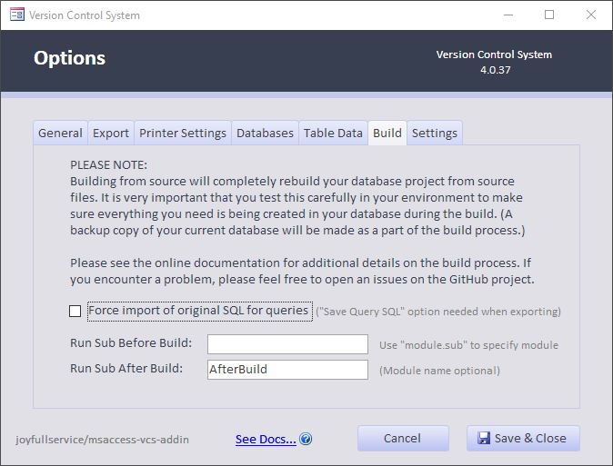

The options dialog can be opened from the main screen by click the `Options` button. Internally the options are stored in a `vcs-options.json` file in the path of the exported source code. These options are loaded and used when exporting to source files, or when building a project from source.

## General Tab

|Setting  |**Default** 
 *(Setting)*|Description
|-|:-:|:-
|**Show Detailed Output**|**Default: Off**|Enable verbose output of each step; useful when you're real curious. This may slow down Export and Build operations.
|**Debug VBA Errors**|**Default: Off**|*(Advanced Users/Add-in Developers)* If an unexpected error occurs in the add-in code, stop and open the VBA IDE to do further debugging. This may be helpful when debugging a problem with the add-in, or reviewing an existing issue. *You should generally keep this off unless you're trying to find the source of a bug, or doing development work on the add-in.*
|**Show Legacy Prompts**|**Default: On**|If you're upgrading from the integrated version of this project, there may be legacy VCS modules left in your database project that are no longer needed. This will notify you if these legacy modules are found. If you would like to keep them in your project, you can uncheck this option to turn off the notification. 
||*On*|Prompts are on.
||*Off*|Prompts are off. 
|**Hash Algorithm**|**Default: SHA256**|You may choose the hashing algorithm here. This may affect build time if you choose a more complex option. (Hashes are used to help determine whether source files have changed between import/export operations.)
||*SHA1*|***WARNING:***
*SHA1 is known to be broken, use of this option is left as a legacy capability and is not recommended.* 

 Use SHA1 hashing algorythm to create hashes.
||*SHA256*|Use SHA256 hashing algorythm to create hashes.
||*SHA512*|Use SHA512 hashing algorythm to create hashes.
|**Use short hashes in index**|**Default: On**|If on, `git` style hashes (first 7 characters) will be used in the file index. 
*NOTE: This was done to improve readability and reduce file size, but you can always uncheck this box if you want to store the full hash.*

## Export Tab

Note that these options only determine what is *Exported* and saved to the JSON file. Any settings defined in the JSON source file will be applied when the Form or Report object is imported, regardless of the currently specified options.

 

|Setting  |**Default** 
 *(Setting)*|Description
|-|:-:|:-
|**Export Folder** |**Default: [Blank]**| Keeping this blank ensures the source code stays local to the development file, and works best with git and other version control systems. Your environment may need other options.
||*[Blank]*|Use default name of `\[database.accdb].src`, i.e. `\Test.accdb.src`
||*Relative Path*|Prefix folder name with a backslash. For example, to export source into a subfolder called `Source`, you would enter `\Source` in this box. 
||*Absolute Path* |You may also use a full path name to a folder. I.e. `W:\Git\Projects\Vehicles Database` 
||*Placeholder* |In combination with the above options, you may also use a `%dbName%` [placeholder](https://github.com/joyfullservice/msaccess-vcs-integration/issues/139) to use the database filename in a custom path. I.e. `\src\%dbName%.src\`
|**Use Fast Save**|**Default: On**|Major performance gain with small changes to large projects. This attempts to only export the objects that have changed since the last export. This especially helps to not have to export forms and reports if they have not changed.
|**Sanitize Level**|**Default: Aggressive**|Set level for sanitize routines to remove noise. Sanitizing allows you to remove noise from your exported files. Turn it off to export raw file outputs. Santization routines are checked to ensure most do not affect building of exported files.
||*None (Off)* | Turn off sanitization, export raw files. These may not import properly, but they may be useful when trying to troubleshoot. 
_**Note:** Files will still be converted to UTF-8 or System Codepage encoding depending on Access Version in this mode._ 
**_NOTE:_ If you set Sanitize level to "*None (Off)*", none of the Sanitize Options (Sanitize Color, Strip out publish, etc.) will be used.**
||*Basic*| Only basic sanitization to ensure reliable rebuilding of files.
|| *Aggressive*| Remove most exported noise (GUIDs, the like). Removes object GUIDs, name maps, and other data that changes from build to build. (These values are recreated automatically when importing source files.) From a development perspective, these are more like binary artifacts that just add noise to the version control commits, reducing clarity on actual code changes.
||*Advanced (Beta)*|Remove as much as possible. This may lead to unexpected changes upon rebuilding. Features that are still in testing or confirmed to be tempermental may be introduced here prior to being implemented. **_User beware!_**

|**Sanitize Colors**|**Default: Basic**|Removes color exports on forms where themes are used, or other situations where the color can be correctly set upon rebuild. These colors export differently in different machines, or different settings and are largely noise. 
 ***NOTE:* The most aggressive options may lead to unexpected color changes on forms!**
|**Strip out Publish Option**|**Default: On**|Strips out some *Publish to Web* settings from source files that are irrelevant to most projects.
|**Save Printer Settings**|**Default: On**|Saves a copy of the print configuration for reports and forms. This is especially useful when you are using specific printer settings. The output is stored in human-readable json. By default, page orientation and paper size are saved with each report, but additional options are also available. 

Show Advanced Printer Options...
 

 |**Save Query SQL**|**Default: On**|In addition to the Access object, this option exports a copy of just the SQL code from queries. I find this much more readable than the source of the Access Object when reviewing what I actually changed on the SQL side. (The Access object includes other information relating to the layout of the query designer.)
|**Save Table SQL**|**Default: On**|In addition to the Access object, this creates a SQL statement like what you would use to create the table. Here again I find this easier to see at a glance what changed in the actual structure of the table between versions.
|**Extract Theme Files**|**Default: Off**|Extract the contents of the `*.thmx` files. Microsoft Office Theme files `*.thmx` are actually zip files containing XML and other files that define the specifics of a theme. If you are customizing a theme, you may wish to extract these files so your changes can be tracked in Version Control.
|**Use git integration**|**Default: Off** |Work in Progress, only part of dev at the moment.
|**Run Sub Before Export**|**Default: [Blank]**|Run a VBA subroutine before exporting the source code. This can be used to clean up temporary data, mask sensitive information, or anything else you want to do. This will be called using  `Application.Run`.
|**Run Sub After Export**|**Default: [Blank]**|Similar to the option above, this allows you to specify a VBA subroutine to run *after* exporting the source code.

## Table Data

The Table Data tab allows you to selectively include certain tables from which to include table ***data*** in version control. The *structure* of the tables is already being saved, but this gives you the additional option of saving the *data* itself.

An example of where you might use this would be a table that defines options or settings in your database application. You might want to track when these settings change. Another example would be a `USysRibbons` table that defines the layout of a custom application ribbon.

The concept here is that you are selecting the table from which you want to save data, choosing the format to use, and clicking Update to save the changes.

|Setting  |**Default** 
 *(Setting)*|Description
|-|:-:|:-
|**Show Hidden**|**Default: Off**|List hidden tables in the current database.
|**Show System**|**Default: Off**|List system tables in the current database.
|**Show Other**|**Default: Off**|List table names that are saved in the options, but do not exist in the current database. You can also manually add table names to your `vcs-options.json` file. (Add a table through the interface first, and use the same syntax.)
|**Selected Table**||This highlights which table you have selected to set the export format. To add a table that is not listed, click the [*Other...*]() link.
|**Data to Export**|**Default: Tab Delimited**|Select the format to use for the exported data.
||*Tab Delimited*|Separate values with tab character. This is a good format to use when importing to Microsoft Excel, or reading the values in Version Control files.
||*XML Format*|Select this option for the most complete and robust representation of the data. It is harder to read in source files, but should import back in to accurate recreate the original data.
||*No Data*|Don't save data for this table.
|**Update**||Save output specification changes for the selected table. You should see the Save Data column update in the list of tables when you click the Update button.

**NOTE:** The following tables should not be added to the export list, as they are already handled by this tool elsewhere.

   | Table Name   | Type | Explanation  
   |-|-|-
   | `MSysResources` |System | Images and Themes are exported in the `.\images\` and `.\themes\` folders, respectively.
   

   

## Build

A unique feature of this add-in is the ability to build a fully functioning database completely from source files. This allows multi-user development in a more typical development workflow where source files are exported and combined to build the end product.

|Setting  |**Default** 
 *(Setting)*|Description
|-|:-:|:-
|**Force import of original SQL for queries**|**Default: Off**|In some cases, such as when a query contains a subquery, _AND_ has been modified in the visual query designer, it may be imported incorrectly and unable to run. For these cases we have added an option to overwrite the .SQL property with the SQL that we saved separately during the export. See [issue #76](https://github.com/joyfullservice/msaccess-vcs-integration/issues/76) for further details.
|**Run Sub Before Build**|**Default: [Blank]**|Same as below, except before the build.
|**Run Sub After Build**|**Default: [Blank]**|Run the specified subroutine after building the project from source files. This is a great way to extend the add-in to add any custom post-build functionality that you need after the build finishes. For example, you might use this to trigger an automated testing routine that verifies that the application is fully functional.

## Settings
These affect your system at large; not just the currently open Access Project.

|Setting  |Description
|-|:-
|**System Defaults**
|*Save as Default*|Save the current options as default for new projects. Anytime you export source and a `vcs-options.json` file does not already exist, it will use the default options that you have specified.
|*Restore Defaults*|In the current project (open database), restore all the options to their default values based on your saved system defaults.
|*Clear Defaults*|Reset all the options to the default settings specified in the add-in source code. If you click this button, then the *Save as Default* button, it will reset any user customizations to the default options.
|**Remove Add-In**
|**Uninstall**|Uninstalls the add-in from your user profile, including all saved defaults and encryption keys. 
 [Click here for Install / Uninstall Instructions](Installation)