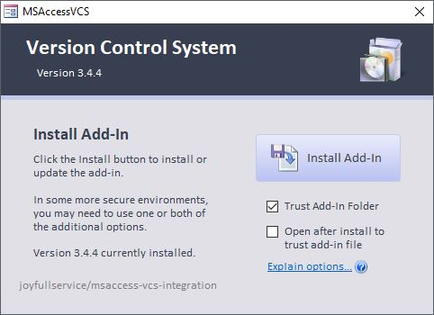
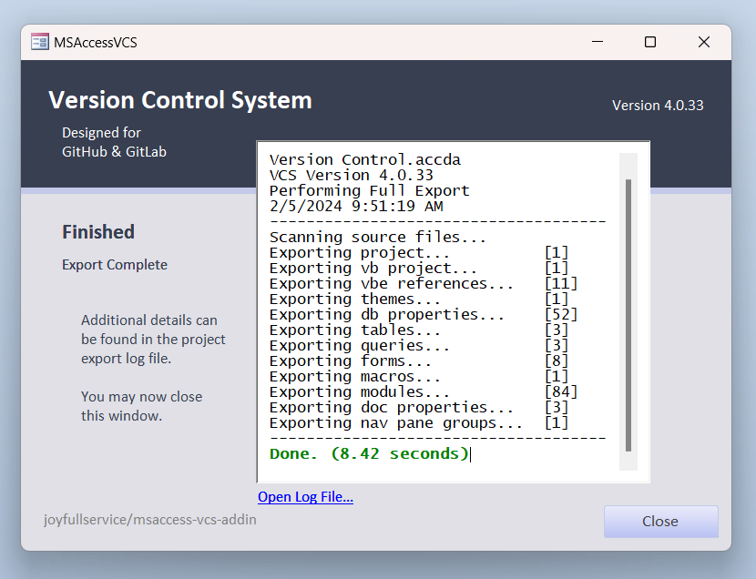
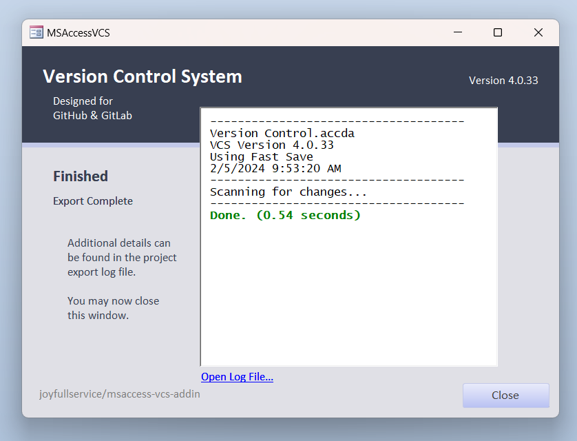
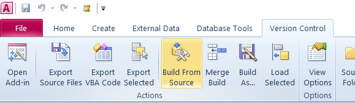
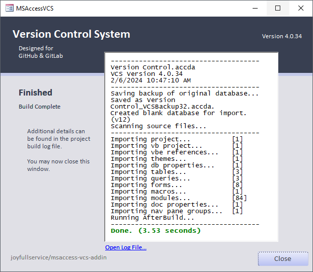

# Quick Start

This add-in performs two primary functions to support rapid application development in Microsoft Access.
- **Export** - Generate text-based source files representing the database components of your project. (table structure, queries, forms, [etc...](Supported-Objects))
- **Build** - Build a fully functional version of your database project directly from source files. You can also [merge](Merge-Build) updated source files into an existing project.

## Install Add-in
 1. Download the [latest release](https://github.com/joyfullservice/msaccess-vcs-integration/releases/latest) from GitHub.
 1. Extract `Version Control.accda` from the downloaded zip archive to a trusted[^1] location.
 1. Open `Version Control.accda` to launch the installer.
 1. Click **Install Add-In**.

## Export Source Files
After installing the add-in, you should see a new ribbon toolbar in Microsoft Access. Open your database project, then click **Export** on the ribbon.

This will launch the add-in and export your project to source files. (By default, in a subfolder under your database project.)

Subsequent exports will be much faster because they will only export changed items.

At this point you can switch over to your version control system (I like GitHub Desktop) and commit the source changes to version control.

## Build From Source

At some point you will probably want to build your project from source, perhaps pulling in source changes from other developers. With your project open, simply click **Build From Source** on the ribbon.

After clicking to confirm the build from source, the add-in will save your current database as a backup, and build a fresh copy from source files.

All set! Your freshly built database is ready to use and continue development. (Note that the first export after a build will be a full export.)

Feel free to check out other wiki pages to learn about [additional options](Options), [merge builds](Merge-Build), [FAQs](FAQs), and more.

Enjoy!!

[^1]: This location must be trusted by Microsoft Access, or the add-in file must be trusted to allow the VBA installercode to run correctly. See `Microsoft Access` -> `Options` -> `Trust Center` -> `Trusted Locations`.
