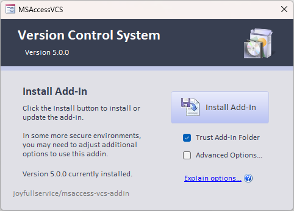
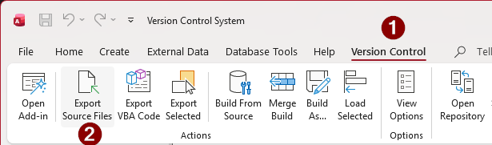
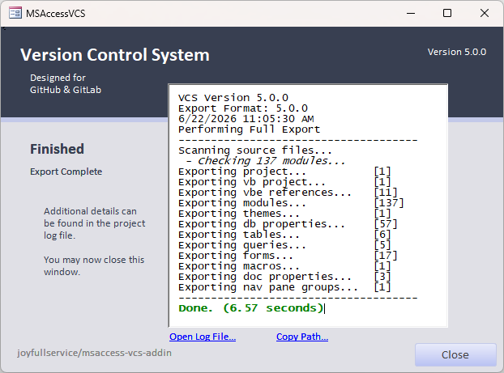
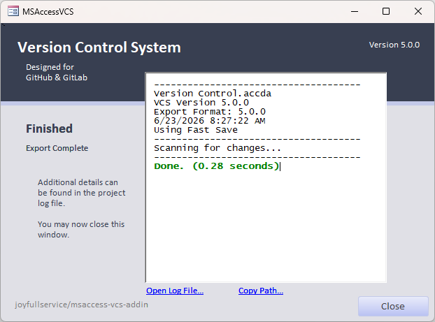
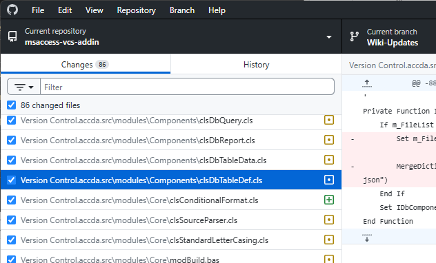
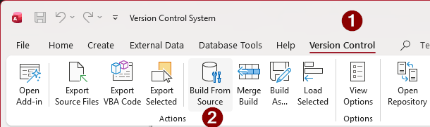
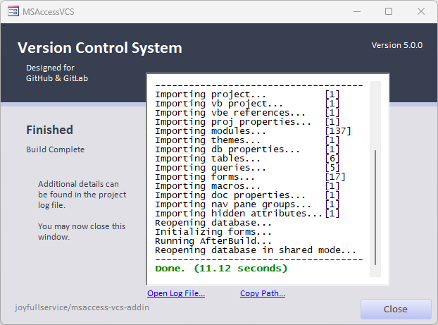

# Quick Start

This add-in supports rapid Access development with two primary operations:

- **Export** — Generate text-based source files for database components ([Supported Objects](Supported-Objects)).
- **Build** — Create a working database from source files.
- **Merge** — Update an existing database from changed source only ([Merge Build](Merge-Build)).

## Install Add-in

1. Download the [latest release](https://github.com/joyfullservice/msaccess-vcs-addin/releases/latest) from GitHub.
2. Extract `Version Control.accda` from the zip archive to a [trusted](Installation#install) location.
3. Open `Version Control.accda` to launch the installer.
4. Click **Install Add-In**. Leave **Use Ribbon Addin** on unless your environment blocks COM add-ins.

See [Installation](Installation) for advanced install options (custom folder, trust on open, 64-bit ribbon).

## Export Source Files

After installing, open your database in Access. Use the **Version Control** ribbon (or **Database Tools** → **Add-Ins** → **VCS Export All Source** if the ribbon is off).

Click **Export**. The add-in exports to a `.src` folder next to your database (default).

The first export may take longer on large projects. Later exports use **Fast Save** and typically finish much faster.

Commit the `.src` folder with your version control tool (for example GitHub Desktop).

**Upgrading an older project?** See [Version 5 Overview](Version-5-Overview) before your first commit after upgrading the add-in.

## Build From Source

To rebuild from source (for example after pulling a teammate's changes), click **Build From Source** on the ribbon.

The add-in backs up your current database file, then builds from the `.src` folder.

The first export after a full build re-exports all objects so the index stays in sync.

## Merge instead of full build

For day-to-day work on large databases, **Merge Build** applies only changed source files. See [Merge Build](Merge-Build).

## Next steps

- [Options](Options) — export folder, sanitization, table data, connections
- [Connections](Connections) — `.env` and `env:conn_*` for linked tables
- [Query Source Files](Query-Source-Files) — editing `.sql` / `.json` in Git
- [FAQs](FAQs) — common issues after build or export

[^1]: The install location must be trusted by Access, or you must trust the add-in file when prompted. See **File** → **Options** → **Trust Center** → **Trusted Locations**.
