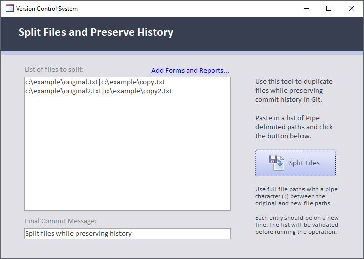

One of the challenges with the .git system is that when a single file is split into two different files the line history *might* follow one of the files, but not both. You loose the line history in one or both files.

That might be a serious problem if you have years of history that you are wanting to preserve. Thankfully, there is a [technical workaround](https://devblogs.microsoft.com/oldnewthing/20190919-00/?p=102904) that does allow you to preserve the history in both files.

# Please Read Before Splitting Files in Existing .git Projects

You can turn on the option and simply perform an export to split the files, **but if you want to preserve the .git history in both files**, please read this section carefully. This add-in includes a utility to help you split the files while retaining the line history in both files. Because this involves **committing** to the repository as part of the process, I want to clarify exactly how this works.

# How This Works

Because this isn't a built-in feature in .git, we need to implement a bit of a clever workaround as documented by Raymond Chen in [this article](https://devblogs.microsoft.com/oldnewthing/20190919-00/?p=102904). In a nutshell, we will create a (temporary) new branch in git, rename the file in the new branch, restore the original file, then merge the new branch back into the original. This will result in two files that both carry the history of the original file.

# Before You Start

You will need to run this process from a **clean branch**. If you have any outstanding changes, please commit or discard them before splitting files. Be aware that this will create **two additional commits** in your repository, so it can be helpful to do this for batches of files, rather than individually for each file.

# Select and Split Layout from VBA

On the VCS ribbon, click Open the **Advanced Tools > Split Files** to open the following dialog.

Click the *Add Forms and Reports...* link to automatically load in the source files for the forms and reports in the current project and create the corresponding `*.cls` files.

Click the button to Split Files. This will begin the automated process of splitting the files while preserving change history. Details and the full output of the git commands can be found in `git.log` in the source files folder.

With the files now split, turn on the VCS option to **Split Layout from VBA** and run an export. At this point you should see both source files modified for each object as the layout is removed from the class file, and the VBA is removed from the layout file.

That's it! Now the VBA code changes can be tracked in the `*.cls` file, and the layout in the `*.bas` file.