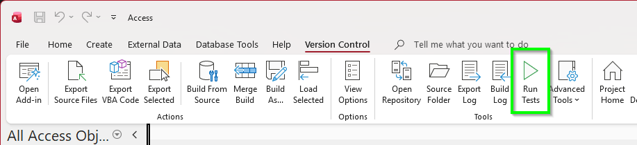
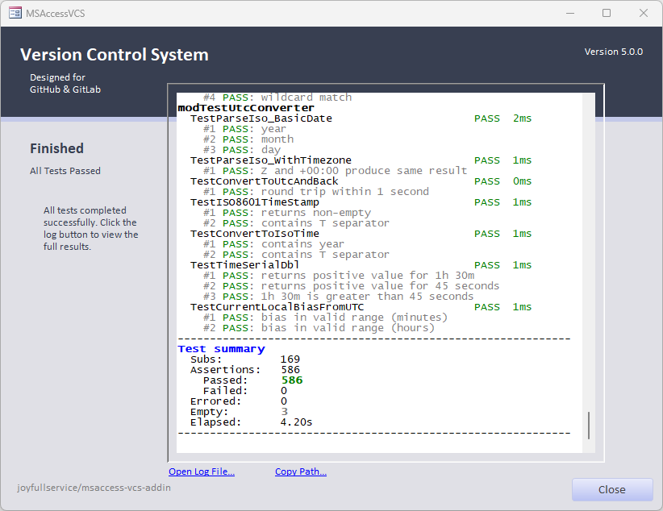
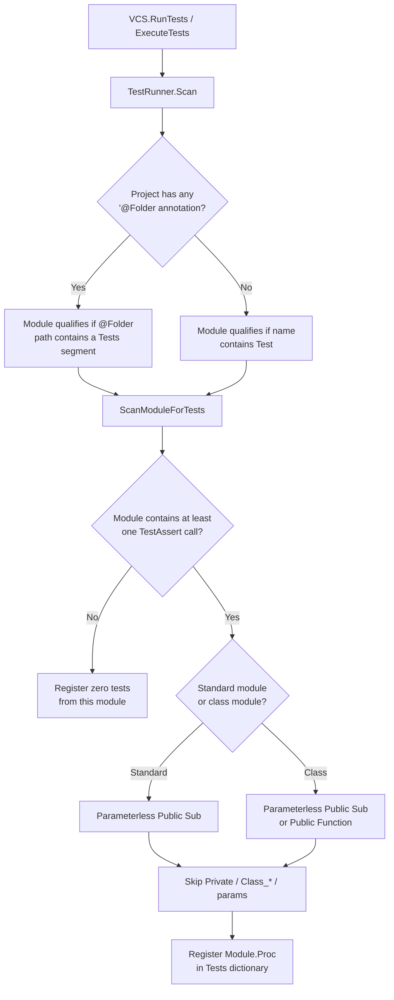
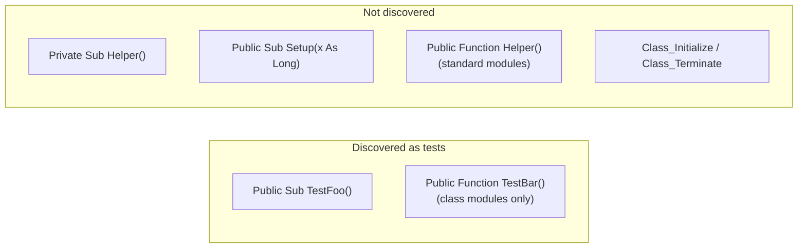
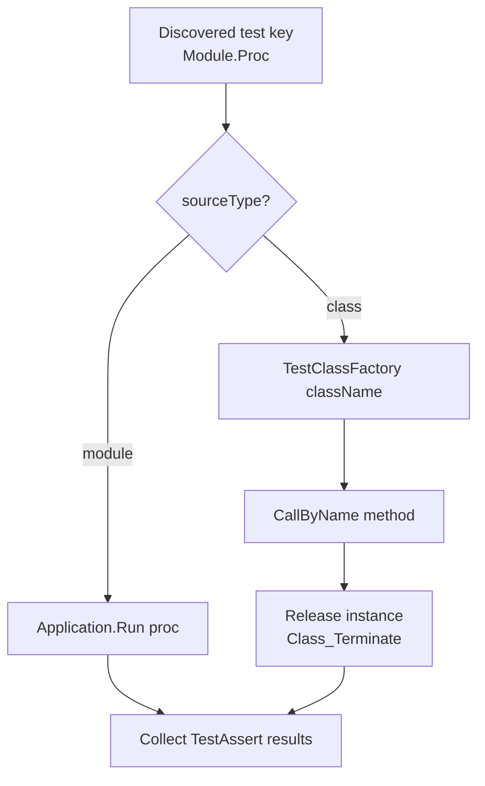

# Testing

The add-in uses **three layers** of tests. Contributors should run the layers relevant to their change before opening a pull request.

---

## Layer 1 — Unit / logic tests (`VCS.RunTests`)

Hundreds of assertions across `modTest*` modules (encoding, JSON, hashing, conflicts, query builder, etc.).

### Run from Access

Open the add-in or development build, then in the Immediate Window:

```vba
?VCS.RunTests
```

Filter examples:

```vba
?VCS.RunTests("modTestEncoding")
?VCS.RunTests("SQL", "-slow")
?VCS.RunTests("TestParseJoinExpression")
```

Tags use `'@Tag("name")` in module or procedure headers. Prefix `-` to exclude.

### Headless (CI / automation)

`VCS.RunTestsHeadless` accepts the same filter arguments but runs with no forms and no prompts: the web runner is bypassed, a missing `modTestAssert` module is installed silently, and JUnit XML is always exported. The returned JSON includes `allPassed`, `cancelled`, `junitPath`, and `statePath` for machine consumption.

```powershell
$addin = "$env:AppData\MSAccessVCS\Version Control.API"
$access = New-Object -ComObject Access.Application
$access.OpenCurrentDatabase("C:\path\to\Database.accdb")
$json = $access.Run($addin, "RunTestsHeadless", "-slow")
$access.Quit()
if (-not ($json | ConvertFrom-Json).allPassed) { exit 1 }
```

CI can assert on the returned JSON or collect `test-results\test-results.xml` (JUnit) from the export folder.

### Ribbon

Set **Default Test Filter** under **Options** → **Advanced**, then click **Run Tests** on the ribbon. Leave blank to run all tests.



### Output

- Progress in `frmVCSMain` console
- JSON summary and `TestRun_*.log` under the add-in `logs/` folder

When the run finishes, the console shows a summary of passed, failed, and skipped tests along with timing:



### How tests are discovered

`VCS.RunTests` does **not** use a `@Test` attribute. Discovery is a static scan of the current VBA project (`clsTestRunner.Scan`): it walks modules via the VBE `CodeModule` API and registers matching procedures.



#### Stage 1 — Test modules

Only **standard modules** and **standalone class modules** are considered (not form/report code-behind).

| Project style | A module is a test module when… |
|---------------|----------------------------------|
| Uses `'@Folder(...)` anywhere | Its `@Folder` path has a `Tests` segment (e.g. `"Tests"`, `"Tests.SQL"`) |
| No `@Folder` annotations | Its name contains `Test` (case-insensitive), e.g. `modTestEncoding` |

#### Stage 2 — Test procedures

Within a qualifying module:

1. The module must contain at least one `TestAssert` call, otherwise nothing is registered from it.
2. **Standard modules:** parameterless `Public Sub` (or bare `Sub`, which is implicitly public).
3. **Class modules:** parameterless `Public Sub` or `Public Function`.
4. Excluded: `Private` procedures, anything with parameters (including an unused `Optional`), and `Class_Initialize` / `Class_Terminate`.

There is no name prefix requirement on the procedure itself — `Test…` is conventional, not required.



#### Tags affect filtering, not discovery

`'@Tag("name")` annotations do **not** control whether a procedure is discovered — they only affect filters passed to `VCS.RunTests`:

- **Module-level** — first ~30 lines, before any procedure → all tests in the module inherit the tag
- **Procedure-level** — comment lines at the top of the body, before the first executable line

#### Writing a discoverable test

```vba
Attribute VB_Name = "modTestMyFeature"
Option Compare Database
Option Explicit
Option Private Module
'@Folder("Tests")
'@Tag("unit")

Public Sub TestSomeBehavior()
    TestAssert MyFunction(42) = 84, "should double input"
End Sub

' Not discovered — has a parameter
Private Sub SetupTempData(strName As String)
End Sub
```

**Class modules** (preferred for new tests that need setup/teardown): each test method gets a fresh instance, so `Class_Initialize` runs before and `Class_Terminate` after every method. Use parameterless `Public Sub` or `Public Function`.

To keep a helper out of the suite, make it `Private` or give it one or more parameters.

#### After discovery — how a test runs



Class-based discovery also keeps a `TestClassFactory` in `modTestAssert` in sync (an auto-generated `Select Case` between BEGIN/END markers — don't edit it by hand).

---

## Layer 2 — Object round-trip (`VCS.RunRoundtripTests`)

Imports each fixture, exports twice, checks idempotency and drift. **Queries** are fully covered today; other object types follow the same harness pattern.

See [Regression Testing](Regression-Testing) for fixtures, rebaseline mode, and contribution workflow.

```vba
?VCS.RunRoundtripTests
?VCS.RunRoundtripTests("C:\path\to\fixtures\", True)  ' rebaseline — review diff!
```

---

## Layer 3 — Integration database

[`Testing.accdb.src`](https://github.com/joyfullservice/msaccess-vcs-addin/tree/dev/Testing/Testing.accdb.src) in the repository — full build/export scenarios for the add-in itself and sample projects.

Use after large import/export or build pipeline changes.

---

## MCP / agents

When **Allow Arbitrary VBA Execution** is enabled:

```
vcs_run_vba(<addin-path>, "MCP_TempFunction = VCS.RunTests(""SQL"", ""-slow"")")
```

See [MCP and Automation](MCP-and-Automation).

---

## PR expectations

| Change type | Minimum testing |
|-------------|-----------------|
| Options / UI copy | Manual smoke export |
| Export/import logic | `RunTests` + affected `RunRoundtripTests` |
| Query parser | `RunRoundtripTests` on `Testing/Fixtures/queries/` |
| Build/merge | Integration build + targeted unit tests |

---

## Related

- [Editing and Contributing](Editing-and-Contributing)
- [Regression Testing](Regression-Testing)
- Repository [`AGENTS.md`](https://github.com/joyfullservice/msaccess-vcs-addin/blob/dev/AGENTS.md)
