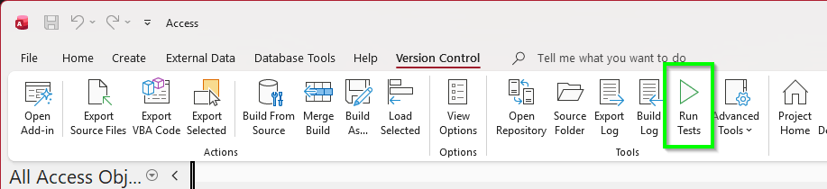
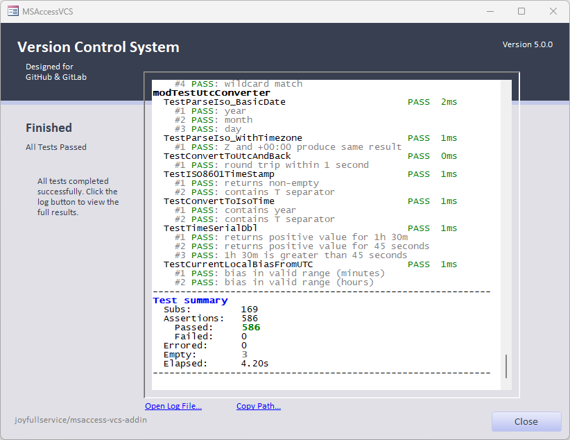
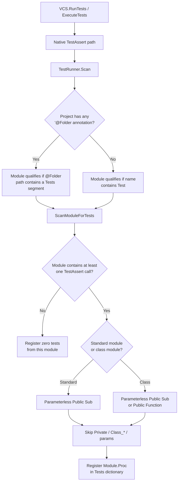
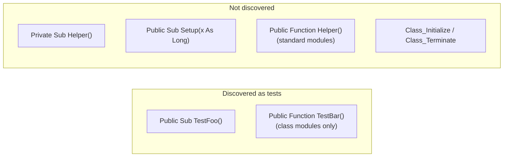
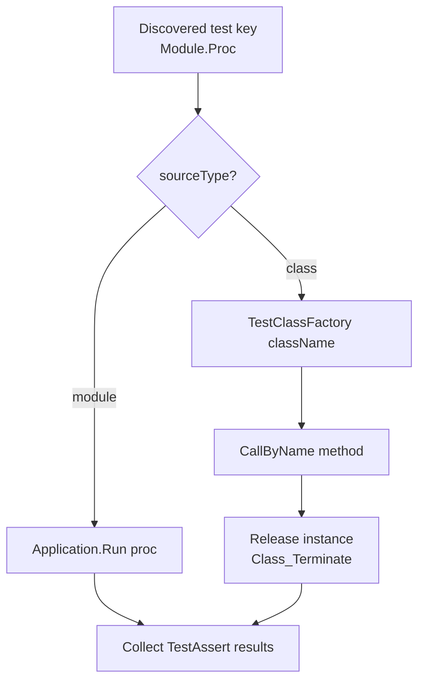

# Testing

The add-in uses **three layers** of tests. Contributors should run the layers relevant to their change before opening a pull request.

---

## Layer 1 — Unit / logic tests (`VCS.RunTests`)

Hundreds of assertions across `modTest*` modules (encoding, JSON, hashing, conflicts, query builder, etc.).

### Run from Access

Open the add-in or development build, then in the Immediate Window:

```vba
?VCS.RunTests
```

Filter examples:

```vba
?VCS.RunTests("modTestEncoding")
?VCS.RunTests("SQL", "-slow")
?VCS.RunTests("TestParseJoinExpression")
```

Tags use `'@Tag("name")` in module or procedure headers. Prefix `-` to exclude.

### Headless (CI / automation)

`VCS.RunTestsHeadless` accepts the same filter arguments but runs with no forms and no prompts: the web runner is bypassed, a missing `modTestAssert` module is installed silently, and JUnit XML is always exported. The returned JSON includes `allPassed`, `cancelled`, `junitPath`, and `statePath` for machine consumption.

```powershell
$addin = "$env:AppData\MSAccessVCS\Version Control.API"
$access = New-Object -ComObject Access.Application
$access.OpenCurrentDatabase("C:\path\to\Database.accdb")
$json = $access.Run($addin, "RunTestsHeadless", "-slow")
$access.Quit()
if (-not ($json | ConvertFrom-Json).allPassed) { exit 1 }
```

CI can assert on the returned JSON or collect `test-results\test-results.xml` (JUnit) from the export folder.

### Ribbon

Set **Default Test Filter** under **Options** → **Advanced**, then click **Run Tests** on the ribbon. Leave blank to run all tests.



### Output

- Progress in `frmVCSMain` console
- JSON summary and `TestRun_*.log` under the add-in `logs/` folder

When the run finishes, the console shows a summary of passed, failed, and skipped tests along with timing:



### How tests are discovered

`VCS.RunTests` uses two static-discovery paths. Its **native `TestAssert` convention** does not use a `@Test` attribute; the separate, opt-in Rubberduck path recognizes `@TestModule` / `@TestMethod` annotations. See [Running Rubberduck test modules](#running-rubberduck-test-modules) for the latter.

#### Native `TestAssert` discovery

The diagram and Stage 1 / Stage 2 rules below apply only to native `TestAssert`-style tests. They do not describe discovery of a Rubberduck `@TestModule`.


```mermaid
flowchart TD
  A[VCS.RunTests / ExecuteTests] --> B[Native TestAssert path]
  B --> C[TestRunner.Scan]
  C --> D{Project has any<br/>'@Folder annotation?}
  D -->|Yes| E[Module qualifies if @Folder<br/>path contains a Tests segment]
  D -->|No| F[Module qualifies if name<br/>contains Test]
  E --> G[ScanModuleForTests]
  F --> G
  G --> H{Module contains at least<br/>one TestAssert call?}
  H -->|No| I[Register zero tests<br/>from this module]
  H -->|Yes| J{Standard module<br/>or class module?}
  J -->|Standard| K[Parameterless Public Sub]
  J -->|Class| L[Parameterless Public Sub<br/>or Public Function]
  K --> M[Skip Private / Class_* / params]
  L --> M
  M --> N[Register Module.Proc<br/>in Tests dictionary]
```

#### Stage 1 — Test modules

Only **standard modules** and **standalone class modules** are considered (not form/report code-behind).

| Project style | A module is a test module when… |
|---------------|----------------------------------|
| Uses `'@Folder(...)` anywhere | Its `@Folder` path has a `Tests` segment (e.g. `"Tests"`, `"Tests.SQL"`) |
| No `@Folder` annotations | Its name contains `Test` (case-insensitive), e.g. `modTestEncoding` |

#### Stage 2 — Test procedures

Within a qualifying module:

1. The module must contain at least one `TestAssert` call, otherwise nothing is registered from it.
2. **Standard modules:** parameterless `Public Sub` (or bare `Sub`, which is implicitly public).
3. **Class modules:** parameterless `Public Sub` or `Public Function`.
4. Excluded: `Private` procedures, anything with parameters (including an unused `Optional`), and `Class_Initialize` / `Class_Terminate`.

There is no name prefix requirement on the procedure itself — `Test…` is conventional, not required.


```mermaid
flowchart LR
  subgraph include [Discovered as tests]
    A1["Public Sub TestFoo()"]
    A2["Public Function TestBar()<br/>(class modules only)"]
  end
  subgraph exclude [Not discovered]
    B1["Private Sub Helper()"]
    B2["Public Sub Setup(x As Long)"]
    B3["Public Function Helper()<br/>(standard modules)"]
    B4["Class_Initialize / Class_Terminate"]
  end
```

#### Tags affect filtering, not discovery

`'@Tag("name")` annotations do **not** control whether a procedure is discovered — they only affect filters passed to `VCS.RunTests`:

- **Module-level** — first ~30 lines, before any procedure → all tests in the module inherit the tag
- **Procedure-level** — comment lines at the top of the body, before the first executable line

#### Writing a discoverable test

```vba
Attribute VB_Name = "modTestMyFeature"
Option Compare Database
Option Explicit
Option Private Module
'@Folder("Tests")
'@Tag("unit")

Public Sub TestSomeBehavior()
    TestAssert MyFunction(42) = 84, "should double input"
End Sub

' Not discovered — has a parameter
Private Sub SetupTempData(strName As String)
End Sub
```

**Class modules** (preferred for new tests that need setup/teardown): each test method gets a fresh instance, so `Class_Initialize` runs before and `Class_Terminate` after every method. Use parameterless `Public Sub` or `Public Function`.

To keep a helper out of the suite, make it `Private` or give it one or more parameters.

#### After discovery — how a test runs


```mermaid
flowchart TD
  A[Discovered test key<br/>Module.Proc] --> B{sourceType?}
  B -->|module| C[Application.Run proc]
  B -->|class| D[TestClassFactory className]
  D --> E[CallByName method]
  E --> F[Release instance<br/>Class_Terminate]
  C --> G[Collect TestAssert results]
  F --> G
```

Class-based discovery also keeps a `TestClassFactory` in `modTestAssert` in sync (an auto-generated `Select Case` between BEGIN/END markers — don't edit it by hand).

---

## Running Rubberduck test modules

Many Access projects already maintain a [Rubberduck](https://github.com/rubberduck-vba/Rubberduck) unit-test suite written to its `@TestModule` / `@TestMethod` convention. The VCS runner can **also** discover and run those modules — so a Rubberduck suite can be driven headlessly, through the web runner, and via MCP, and reported alongside `TestAssert`-based tests — **without rewriting the test bodies**.

This is a **second, opt-in discovery path**: it activates only for a module that declares `'@TestModule`. Modules without that annotation stay on the native convention above. The two runners remain independent — the VCS runner is a second surface that recognizes the same annotations, **not** a replacement for the Rubberduck Test Explorer, and Rubberduck is **never a required dependency**.

See the Rubberduck [Unit Testing wiki](https://github.com/rubberduck-vba/Rubberduck/wiki/Unit-Testing) for how to author these tests.

### How it works

Rubberduck reports each assertion through an internal event that only its own engine listens to, so the VCS runner cannot reuse the real `Rubberduck.AssertClass` directly. Instead, each project supplies a small **shim** (`StubRdAssert.cls`, obtained through a `CreateTestAssert()` factory) that replicates the `AssertClass` surface. Per call the shim branches:

- **Under a VCS run** — the shim computes the outcome itself and reports it to the add-in.
- **Under the Rubberduck Test Explorer** (or with the add-in not loaded) — the shim delegates to a real `Rubberduck.AssertClass`, so Rubberduck captures results exactly as before.

Because the shim owns both modes, the same module normally produces matching results under both runners. The VCS runner intentionally differs when an Inconclusive assertion is followed by a later failure; see [The `Inconclusive` status](#the-inconclusive-status). The shim lives in your project (in a build-stripped `Stub*` module), not in the add-in.

When it runs an `@TestModule`, the VCS runner honors the Rubberduck lifecycle: `@ModuleInitialize` once → for each test `@TestInitialize` → test → `@TestCleanup` → `@ModuleCleanup` once. `@IgnoreTest` methods are skipped.

### Migrate one module

Start with one fast, deterministic **standard-module** test suite. Keep your existing
Rubberduck module and test bodies; make the mechanical changes below, then verify both
runners before converting more modules.

1. Copy the maintained [Rubberduck-to-VCS template](https://github.com/joyfullservice/msaccess-vcs-addin/tree/dev/Testing/Templates/Rubberduck-Vcs) into your source project: `StubRdAssert.cls` and `basTestHelpers.bas`. The template's `ExampleTestModule.bas` is a complete converted example.
2. Exclude `StubRdAssert` and `basTestHelpers` from your production build using your project's normal test-only build rules.
3. In the test module, replace the compile-time Rubberduck assertion field with a late-bound one and initialize it through the factory:

   ```vba
   ' Before
   Private Assert As Rubberduck.AssertClass

   '@ModuleInitialize
   Private Sub ModuleInitialize()
     Set Assert = New Rubberduck.AssertClass
   End Sub

   ' After
   Private Assert As Object

   '@ModuleInitialize
   Public Sub ModuleInitialize()
     Set Assert = CreateTestAssert()
   End Sub
   ```

4. Change each annotated `@TestMethod`, `@ModuleInitialize`, `@ModuleCleanup`, `@TestInitialize`, and `@TestCleanup` procedure to `Public` so the VCS runner's temporary dispatcher can call them. Leave unannotated helpers `Private`. Keep `Option Private Module` if your test project already uses it: it still prevents the module's public members from being exposed outside the project. Preserve every Rubberduck annotation and test body.
5. Compile the project. Run the converted module in the Rubberduck Test Explorer first, then run that module by name through `VCS.RunTests` or `VCS.RunTestsHeadless`.
6. Compare results before migrating the next module. If the module uses an assertion method, `FakesProvider`, or mocks not covered by the template, extend the project-side shim and verify that behavior in both runners first.

The template supports the listed `AssertClass` subset only; it does not make every
Rubberduck API available. It also supports standard-module `@TestModule`s only;
class-module Rubberduck lifecycles are not driven by the VCS runner.

### Verify the first conversion

Use one converted module as the acceptance check before migrating a suite:

1. Compile the database in Access. The VCS runner stops before executing tests when the project has compile errors.
2. Run that module in the Rubberduck Test Explorer and record its pass, fail, inconclusive, and skipped counts.
3. In the Access Immediate Window, run the same module through the VCS runner:

  ```vba
  ?VCS.RunTests("ExampleTestModule")
  ```

  With the web runner enabled, this opens the test tree; select the module and choose **Run**. Otherwise, follow the result in the `frmVCSMain` console.
4. For an unattended check, run the same filter through `VCS.RunTestsHeadless("ExampleTestModule")`. Its returned JSON includes `allPassed`, `cancelled`, `junitPath`, and `statePath`; it always writes JUnit XML.
5. Compare the two runners' results, allowing for the documented record-and-continue Inconclusive case below. Inspect `<export-folder>\test-results\test-results.xml`, `test-state.json`, and (when enabled) `test-results.html` for the persisted result.

For MCP-driven runs, enable the relevant permissions under **Options** → **MCP** first; see [MCP and Automation](MCP-and-Automation). Run against a development copy, not a production database.

### Filtering and skipped tests

VCS filters use module names, `@Folder`, procedure names, and explicit
`'@Tag("...")` annotations. A Rubberduck `@TestMethod("Category")` argument is **not**
automatically a VCS tag. Add a `@Tag` annotation when a Rubberduck category must also
be selectable through `VCS.RunTests` or `VCS.RunTestsHeadless`:

```vba
'@TestMethod("Integration")
Public Sub TestRemoteService()
  '@Tag("integration")
  ' ...
End Sub
```

`@IgnoreTest` is discovered as **Skipped** rather than omitted. The VCS runner does not
execute it, preserves an optional quoted reason, shows it in the test tree, and emits it
as JUnit `<skipped/>`. A module containing only ignored tests does not run its lifecycle
hooks.

### The `Inconclusive` status

Rubberduck treats some assertions as **Inconclusive** rather than passed or failed:

- `AreEqual` / `AreNotEqual` where the two operands have **different types** (e.g. `AreEqual 42, "42"` or `AreEqual 42, Null`)
- `AreSame` / `AreNotSame` on **value types** (not object references)
- an explicit `Assert.Inconclusive([message])` call

The VCS runner models this as a first-class status (amber ⚠ in the web runner and HTML report, with its own count, filter, and progress segment). Behavior to know:

- **Precedence** within a test: `Errored > Failed > Inconclusive > Passed` — an inconclusive assertion never masks a real failure.
- **Inconclusive is non-failing.** It does not flip `allPassed` or fail a headless CI run (matching Rubberduck's default). A run of *only* inconclusive tests is still not `allPassed`, because nothing passed.
- **JUnit:** an inconclusive test serializes to `<skipped/>` (the closest standard-schema equivalent).

> **One intentional divergence from the Rubberduck Test Explorer:** the VCS runner records every assertion and continues, whereas Rubberduck stops at the first non-passing assertion. A test that is inconclusive and *then* would fail reports **Failed** under the VCS runner (later Fail wins under precedence) but **Inconclusive** under Rubberduck. Author tests to reach a single conclusive outcome and this never arises.

### Running them

Once a module is shim-migrated, it runs through the same entry points as any other VCS test — [`VCS.RunTests`](#run-from-access), [`VCS.RunTestsHeadless`](#headless-ci--automation), the ribbon **Run Tests** button, and [MCP](#mcp--agents). Filter by module, folder, procedure, or tag exactly as with native tests.

### Internals

Maintainers and agents: the discovery path, lifecycle driver, multi-module dispatcher (which sidesteps an Access `Application.Run` name-collision on shared lifecycle proc names), and the tri-state model are documented in [`docs/rubberduck-test-runner.md`](https://github.com/joyfullservice/msaccess-vcs-addin/blob/dev/docs/rubberduck-test-runner.md).

---

## Layer 2 — Object round-trip (`VCS.RunRoundtripTests`)

Imports each fixture, exports twice, checks idempotency and drift. **Queries** are fully covered today; other object types follow the same harness pattern.

See [Regression Testing](Regression-Testing) for fixtures, rebaseline mode, and contribution workflow.

```vba
?VCS.RunRoundtripTests
?VCS.RunRoundtripTests("C:\path\to\fixtures\", True)  ' rebaseline — review diff!
```

---

## Layer 3 — Integration database

[`Testing.accdb.src`](https://github.com/joyfullservice/msaccess-vcs-addin/tree/dev/Testing/Testing.accdb.src) in the repository — full build/export scenarios for the add-in itself and sample projects.

Use after large import/export or build pipeline changes.

---

## MCP / agents

When **Allow Arbitrary VBA Execution** is enabled:

```
vcs_run_vba(<addin-path>, "MCP_TempFunction = VCS.RunTests(""SQL"", ""-slow"")")
```

See [MCP and Automation](MCP-and-Automation).

---

## PR expectations

| Change type | Minimum testing |
|-------------|-----------------|
| Options / UI copy | Manual smoke export |
| Export/import logic | `RunTests` + affected `RunRoundtripTests` |
| Query parser | `RunRoundtripTests` on `Testing/Fixtures/queries/` |
| Build/merge | Integration build + targeted unit tests |

---

## Related

- [Editing and Contributing](Editing-and-Contributing)
- [Regression Testing](Regression-Testing)
- Repository [`AGENTS.md`](https://github.com/joyfullservice/msaccess-vcs-addin/blob/dev/AGENTS.md)
