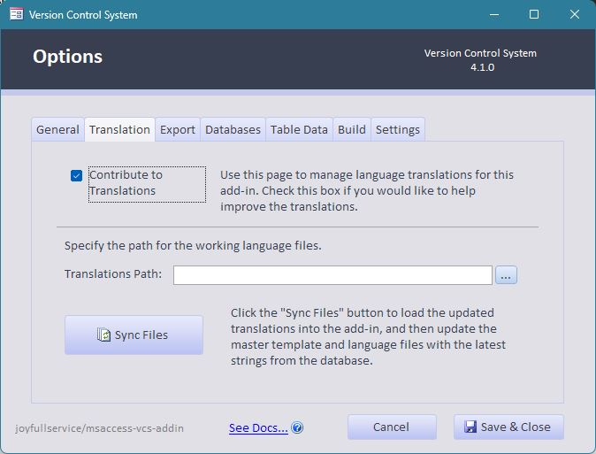

The most recent version of this tool can provide translation support in the AddIn interface (not for your application).


See [Translations Issue](https://github.com/joyfullservice/msaccess-vcs-integration/issues/87) for more details.


# Options Translation Tab 

**Note:** This tab is normally hidden.



|Setting  |**Default** <p> *(Setting)*|Description
|-|:-:|:-
|**Contribute to Translations**|**Default: _On_**|Select this button if you wish to help manage translations.
|**Translations Path**|**Default: _[Blank]_**|Define the FOLDER path to the `*.pot` translation files.
|**Button _"Sync Files"_**||Click button to sync the database with the updated Translation files.


# Defining Translations in the AddIn

Translations for text are facilitated by calling `T()`. `clsTranslation` is the translation class facilitating language translation functions. `modObjects.T` is where `clsTranslation` is loaded.

|Input (Output) |Variable Type|**Required** <p> *(Optional Default Value)*|Description
|-|:-:|:-:|:-
|strText|`String`|**Required**|The text to be translated. Use variable tags to facilitate variable substitutions (such as file paths).<p>Example: `T("Some String Translation Path: {0}",var0:=SomePath)`
|strReference|`String`|Optional <p>_`vbNullString`_|
|strContext|`String`|Optional <p>_`vbNullString`_|
|strComments|`String`|Optional <p>_`vbNullString`_|
|var0|`Variant`|Optional|`{0}` substitution; converts to `String` for translation.
|var1|`Variant`|Optional|`{1}` substitution; converts to `String` for translation.
|var2|`Variant`|Optional|`{2}` substitution; converts to `String` for translation.
|var3|`Variant`|Optional|`{3}` substitution; converts to `String` for translation.
|var4|`Variant`|Optional|`{4}` substitution; converts to `String` for translation.
|var5|`Variant`|Optional|`{5}` substitution; converts to `String` for translation.
|var6|`Variant`|Optional|`{6}` substitution; converts to `String` for translation.
|var7|`Variant`|Optional|`{7}` substitution; converts to `String` for translation.
|var8|`Variant`|Optional|`{8}` substitution; converts to `String` for translation.
|var9|`Variant`|Optional|`{9}` substitution; converts to `String` for translation.


# Translation Definition

See `modObjects` for most up to date definition.

```VBA
'---------------------------------------------------------------------------------------
' Procedure : T
' Author    : Adam Waller
' Date      : 3/19/2024
' Purpose   : Wrapper function to translate to current language
'---------------------------------------------------------------------------------------
'
Public Function T(strText As String, Optional strReference As String, _
    Optional strContext As String, Optional strComments As String, _
    Optional var0, Optional var1, Optional var2, Optional var3, Optional var4, _
    Optional var5, Optional var6, Optional var7, Optional var8, Optional var9)
    T = Translation.T(strText, strReference, strContext, strComments, _
        var0, var1, var2, var3, var4, var5, var6, var7, var8, var9)
End Function
```

# Example Use of T()
In this example, the result of `T()` to a (fictitional) translation lanuage `ENG ALL CAPS` of `"Error with module: {0}"` would be `ERROR WITH MODULE: Some Cool Name"`.

```VBA
' Example Use of T()
Public Sub RunStuffOrNot()
    Const FunctionName As String = ModuleName & ".RunStuffOrNot"
    Dim strName As String

    ' All Kinds of code
    strName = "Some Cool Name"

    CatchAny eelError, T("Error with module: {0}", var0:=strName), FunctionName

End Sub
```