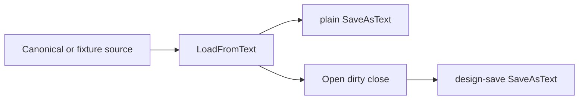
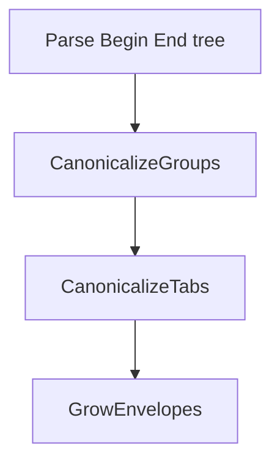
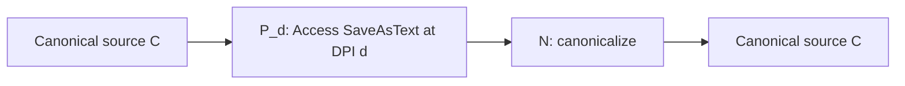

# Access Form Layout Geometry

How Microsoft Access stores and re-solves layout-group geometry in
`SaveAsText` form exports, and how this add-in canonicalizes that geometry
onto a 60-twip lattice so source files stay stable across developer DPIs.

**Status:** Characterized from fixture data captured through Access's own
`SaveAsText` export. Suitable as a working reference for layout-group
canonicalization. The standard-scale Access proof is complete at
96 / 120 / 144 / 168 / 192 DPI. Custom scaling is measured at 133%
only; see §9.

This document is about layout geometry and DPI only. The rest of form
storage — control blocks, sections, binary blobs — belongs in a future
`access-form-storage.md`. Architectural rationale lives in the 2026-09-08
entry of [`DECISIONS.md`](../DECISIONS.md). How to re-run the probe is in
[`tools/dpi-layout-probe/README.md`](../tools/dpi-layout-probe/README.md).

---

## 0. Implementation in this repo

The sanitizer lives in
[`clsFormGeometryCanonicalizer.cls`](../Version%20Control.accda.src/modules/Core/clsFormGeometryCanonicalizer.cls).
It is a port of the Python oracle
[`tools/dpi-layout-probe/form_geometry.py`](../tools/dpi-layout-probe/form_geometry.py),
which remains the executable specification. The two implementations stay
aligned by sharing the same pass order and the same fail-closed rule. The
oracle additionally records proof-only logical values for geometry lines
Access omitted; that bookkeeping does not change the emitted source.

It is wired into the export path by
[`clsSourceParser.cls`](../Version%20Control.accda.src/modules/Core/clsSourceParser.cls)
inside `SanitizeObject`:

- On **form** export, after `NormalizeViewport`, when
  `SanitizeLevel > eslMinimal` and `ExportFormatVersion >= EFV_5_1_0`.
- `LayoutCached*` is used as optional edge data during the rewrite, then
  stripped for forms at the same format gate.
- **Reports are not canonicalized.** Their `LayoutCached*` lines stay.
- Import is ungated. Older source without the rewrite imports unchanged.

The Forms exporter revision is 2 so existing 5.1.0 beta projects re-export
once. See [`modConstants.bas`](../Version%20Control.accda.src/modules/Infrastructure/modConstants.bas)
(`GetExporterRevisions`) and
[`docs/export-format-versioning.md`](export-format-versioning.md).

VBA coverage lives in
[`clsTestSourceParser.cls`](../Version%20Control.accda.src/modules/Tests/Core/clsTestSourceParser.cls)
(`TestFormGeometry_*`). Shipped agent guidance is the geometry paragraph
of [`vcs-agent-docs/forms-reports.md`](../Version%20Control.accda.src/vcs-agent-docs/forms-reports.md).

Behavior:

- Rewrites present `Left` / `Top` / `Width` / `Height` in place. Never
  adds or removes a geometry property.
- Snaps layout-group track sizes and boundary pitches to 60 twips, then
  derives spanning bounds.
- Leaves free-positioned control geometry alone, preserves distinct gap
  classes, and retains every `EmptyCell` block while canonicalizing its
  layout geometry.
- Fails closed on underdetermined groups: the group is logged and left
  unchanged.
- Snaps Tab `Width` / `Height`. Page insets stay DPI-local.
- Snaps form `Width` and section `Height` to the nearest lattice point,
  then raises them when necessary so canonical children do not clip.

---

## 1. The churn problem

Access stores control geometry in twips (1/1440 inch). When a form is
saved, Access converts those values through the current display's
pixels-per-inch and writes the result back. Two developers editing the
same form at different Windows scaling settings therefore commit
different numbers for the same layout.

Two symptoms follow:

1. **Untouched-form churn.** Opening and re-exporting a form that nobody
   edited still rewrites layout geometry to the local DPI. The add-in's
   `InitializeForms` design-view open/dirty/close (added so Access would
   render theme colors, later forced to save so viewport placeholders
   would resolve) makes this the default export path.
2. **Edit amplification.** A one-control caption change, or a one-track
   resize, causes Access to re-solve the whole layout group. Hundreds of
   sibling `Left` / `Top` / `Width` / `Height` values then appear in the
   diff at the editor's DPI, burying the real edit.

Both are source-file problems. The in-database geometry will always be
whatever the last save projected. The add-in's job is to make the
*exported* representation independent of that projection.

---

## 2. How Access stores layout geometry

A `SaveAsText` form is a nested `Begin` / `End` tree. Layout-view
controls participate in a group identified by two integer properties:

| Property | Role |
|---|---|
| `GroupTable` | Which layout table the control belongs to |
| `LayoutGroup` | Which group within that table |
| `ColumnStart` / `ColumnEnd` | Inclusive column tracks the cell occupies |
| `RowStart` / `RowEnd` | Inclusive row tracks the cell occupies |
| `Left` / `Top` / `Width` / `Height` | Authored (or last-solved) geometry, in twips |
| `LayoutCachedLeft` / `Top` / `Width` / `Height` | Derived edges; see below |
| `HorizontalAnchor` / `VerticalAnchor` | Runtime resize behavior; not persisted as geometry |

A cell with `ColumnStart = ColumnEnd` occupies one column. A cell with
`ColumnStart < ColumnEnd` spans. The same applies to rows. `EmptyCell`
blocks are spacer cells Access inserts to keep the grid rectangular;
they carry the same group and track properties as a visible control.

**Free-positioned controls** have no `LayoutGroup` / `GroupTable`. Their
geometry is authored, not solved, and does not drift with DPI. The
canonicalizer leaves them alone.

**`LayoutCached*` is derived, not authored.** Measured by feeding wrong
values back through `LoadFromText` / `SaveAsText`: Access always writes
the computed edges (`LayoutCachedWidth = Left + Width`,
`LayoutCachedHeight = Top + Height`). Dropping the cache lines alone
does not trigger a destructive re-solve. They are useful as optional
edge data when Access omits a redundant `Height` or `Width`, then they
are stripped from the export so they cannot churn.

A control is treated as a layout cell if it has `LayoutGroup` or
`GroupTable`. Groups are keyed by `(GroupTable, LayoutGroup)`.

---

## 3. How Access re-solves it

The probe captures two export paths from the same import:



- **`plain/`** — `LoadFromText` followed immediately by `SaveAsText`.
- **`design-save/`** — the same import, then the open/dirty/close
  sequence used by `InitializeForms`, then `SaveAsText`.

### The two paths are not the same projection

Early measurements looked as if `LoadFromText` itself re-solved. A
12-twip-grid form imported on a 96-DPI machine and re-exported *without*
opening design view came back as the 15-twip-grid variant, byte-identical
to a working-tree file that had been saved at 100% scaling. That
observation was real and is easy to reproduce — and it is also
incomplete.

Chained runs later showed that the plain path has **memory**. When the
input was a previously-solved export from the same DPI, `LoadFromText`
preserved those numbers. When the input was a base fixture that had
never been solved at that DPI, the plain path rewrote it. The
design-save path has no such memory: it is a true projection of the
current DPI onto whatever was imported.

Treating the plain path as identity therefore looked correct on chained
A→B→A runs of already-solved files, and then failed as soon as a
fresh fixture crossed a DPI boundary. The design-save is the path the
add-in actually uses on export, and it is the path the invariant in §6
must survive.

Resolution (pixel dimensions at a fixed scaling) does not move layout
geometry. Only scaling does. Existing `NormalizeViewport` already
removes the designer-window `Left` / `Top` / `Right` / `Bottom` that
resolution does change.

Anchors (`HorizontalAnchor` = right or stretch) do not change the
projection. They affect runtime reflow when a form is resized, which is
never persisted as geometry.

### Omitting a layout property is destructive

Access will re-solve a group from scratch if any authored geometry
property is missing. That re-solve discards `EmptyCell` spacers it no
longer considers necessary.

Measured on the harvested multi-row spacer layout that became
`SpacerGrid`:

| Operation | Result |
|---|---|
| Baseline `LoadFromText` / `SaveAsText` | 182 controls → 182 |
| Drop `LayoutCached*` only | 182 → 182; no re-solve |
| Drop `Left` from non-anchor cells | 182 → 54; spacers gone |
| Drop a single `Left` | 128 of the 182 losses |

Preserving `Left` on the `EmptyCell` blocks themselves did not save
them. The re-solve is group-wide: one omitted property is enough. This
is why the canonicalizer rewrites values in place and never deletes a
geometry line.

---

## 4. Why 60 twips

A twip is 1/1440 inch. Windows scaling changes how many twips map to
one pixel:

| Scaling | DPI | Twips per pixel | 60 twips in pixels |
|---|---|---|---|
| 100% | 96 | 15 | 4 |
| 125% | 120 | 12 | 5 |
| 150% | 144 | 10 | 6 |
| 175% | 168 | ≈ 8.57 | 7 |
| 200% | 192 | 7.5 | 8 |

60 twips is 1/24 inch. It is a whole number of pixels at every standard
25-percentage-point Windows scaling step. A direct
twips-to-pixels-and-back conversion of a value on that lattice is exact
at those settings. That does **not** make Access's full layout projection
an identity: its solver still moved canonical values at 144 and 192 DPI,
then `N` recovered them. The exact-conversion claim does **not** extend
to arbitrary custom scaling
(110%, 133%, and so on): 60 twips is 5.333 pixels at 128 DPI
(133.33%), so not every 60-twip lattice point maps to a whole pixel.
The Access
invariant at that one custom scale is a separate measurement; see
§7.

Independent (per-value) snapping of the four captured DPI outputs,
measured on the probe fixtures:

| Grid | Values unified across all four DPIs | Max shift |
|---|---|---|
| None | 42.3% | — |
| 15 twips | 67.0% | 7 |
| 30 twips | 73.5% | 15 |
| **60 twips** | **85.5%** | **30** |
| 120 twips | 84.3% | (shifts double) |
| 240 twips | 91.7% | 120 (visible) |

60 is the theoretical lattice *and* the empirical sweet spot for
independent rounding. The remaining 14.5% is not noise: two DPI
variants of the same cell can straddle a midpoint, and independently
rounded positions accumulate. On the five-column tabular fixture the
fifth column moved **75 twips** under naive snap — more than the
30-twip per-value budget. That is why the algorithm snaps *origins and
pitches*, then derives everything else, rather than rounding each
`Left` on its own.

A read-only structure-aware prototype that did exactly that unified
**all 311 available layout geometry properties** across the six
harvested fixtures at 96 / 120 / 144 / 192 DPI. Only Tab/Page-derived
geometry remained inconsistent; see §9.

---

## 5. The algorithm, pass by pass

`Canonicalize` parses the `Begin` / `End` tree up to `CodeBehindForm`,
then runs four passes. Inline binary blocks (`Prop = Begin` … `End`)
are skipped so hex payloads are not mistaken for properties.



### 5.1 Group cells

Collect every block that has `LayoutGroup` or `GroupTable`. Bucket by
`(GroupTable, LayoutGroup)`. Each group is planned as a whole; a
failure on either axis leaves the entire group unchanged.

### 5.2 Plan the horizontal axis, form-wide

For each group:

1. **Track sizes.** For every single-span cell (`ColumnStart = ColumnEnd`)
   whose width is known (`Width`, or `LayoutCachedWidth - Left`),
   record the width. The snapped size of a track is the median of those
   observations, snapped to 60.
2. **Boundary positions.** For every cell with a known `Left` (or
   `LayoutCachedLeft`), record the position at that `ColumnStart`. Snap
   the leftmost origin. Snap each successive *pitch* (difference
   between adjacent column origins) and accumulate. Positions are
   therefore derived, not independently rounded.
3. **Infer end-track sizes.** A spanning cell whose start and end
   origins are known can imply the last track's size:
   `size(end) = spanWidth - (pos(end) - pos(start))`. Used only when
   that track has no single-span witness.
4. **Rewrite.** If `Left` is present, replace it with the planned
   origin of `ColumnStart`. If `Width` is present, replace it with the
   track size (single-span) or `pos(end) + size(end) - pos(start)`
   (span). If any required witness is missing, the group is
   underdetermined: log a warning and leave every property in the
   group as written.

### 5.3 Plan the vertical axis, per section

The same four steps, but cells are first split by their containing
section (`Section`, `FormHeader`, `FormFooter`, `PageHeader`,
`PageFooter`). A tabular layout that crosses the header/detail boundary
shares one horizontal plan and gets a separate vertical plan in each
section. `Top` / `Height` / `RowStart` / `RowEnd` play the roles of
`Left` / `Width` / `ColumnStart` / `ColumnEnd`.

If any section's vertical plan fails, the whole group — including the
already-computed horizontal plan — is left unchanged.

### 5.4 Snap Tab chrome; leave Page insets

Non-layout `Tab` controls have their `Width` and `Height` snapped
independently. `Page` `Left` / `Top` / `Width` / `Height` are not
touched. Tab header insets are DPI-dependent and straddle the 60-twip
midpoint, so Page geometry does not unify across standard scaling
steps. Layout groups *on* a Page are still canonicalized as groups.

### 5.5 Grow envelopes

If the form contains at least one layout cell:

- Form `Width` becomes `max(snap(current), snap_up(max child Right))`.
- Each section `Height` becomes
  `max(snap(current), snap_up(max child Bottom))`, ignoring Tab and
  Page descendants so chrome does not inflate the section.

`snap` recovers small DPI perturbations of the current envelope instead
of turning them into a full 60-twip increase. `snap_up` rounds child
extents to the next lattice point at or above the value, so normalization
never clips a child that just snapped outward. Forms with no layout cells
are skipped entirely.

`RewriteProp` is a no-op when the value is already correct and when the
property is absent. The sanitizer cannot invent a line Access did not
write.

---

## 6. The invariant

Let `C` be a canonical source file, `P_d` the Access projection at
display DPI `d`, and `N` the canonicalizer. The proof checks `P_d`
separately for the `plain` and `design-save` export paths.

```text
N(P_d(C)) = C
```



What this claims: if you import a canonical form, let Access re-solve
it at whatever DPI the machine is running, export it, and canonicalize
the export, you get the same canonical geometry signature back.

What this does **not** claim:

- That Access stores canonical numbers internally. It does not. The
  in-database geometry is whatever `P_d` last wrote.
- That `P_d(C)` equals `C`. Access may omit a redundant `Height` or
  `Width` that `LayoutCached*` still implies, and it rewrote present
  values at 128, 144, and 192 DPI. The canonicalizer recovered `C` in
  every measured case.
- That a track edit produces a one-control diff. Siblings that share
  the edited track are rewritten; that is the layout's semantics.

The comparison used to prove the invariant is a geometry signature:
named blocks' `Left` / `Top` / `Width` / `Height`, form `Width`, and
section `Height`, with omitted control sizes recovered from
`LayoutCached*` edges and the canonical group plan when possible. Page
blocks are excluded. Access may add or omit a redundant default
control `Width` / `Height`; a remaining one-sided size is equivalent,
but `Left` / `Top` must be present on both sides and equal. It is not a
byte-identical file compare.

---

## 7. Measured evidence

All figures below come from the Python oracle unless noted. The
`TestFormGeometry_*` unit tests check the VBA port against synthetic
form strings; the cross-DPI invariant is proved only by the Python plus
Access probe. The add-in's object round-trip harness currently routes
query fixtures only; it does not yet contain form fixtures.

### DPI unification

The oracle produces identical layout-geometry signatures from the
captured 96 / 120 / 144 / 192 DPI outputs of the harvested fixtures on
both the plain and design-save paths (Page chrome excluded; see §9).

### Round-trip proof

`N(P_d(C)) = C` holds on both `plain` and `design-save` for the six
harvested fixtures (`TabularGrid`, `RightAnchored`, `MultiRowGrid`,
`StretchAnchored`, `SpacerGrid`, `StackedGrid`) at 96, 120, 128, 144,
168, and 192 DPI. Compact
oracle-only sketches (`CustomGap`, `ZeroGap`, `ColumnSpan`) are not full
forms; Access rejects them with "This object was saved in an invalid
format", so they are excluded from the Access proof and kept for the
oracle.

At 96 and 168 DPI, `P_d(C)` already matched `C` on the geometry
signature, so the projection and the invariant were
indistinguishable. At 120, 128, 144, and 192 they split: Access rewrote
present values on every form, and `N` recovered `C` on both paths.
Worst projection shift was 108 twips on `SpacerGrid` at 120 DPI
(53 properties), 90 twips on the same form at 144 (53 properties),
68 twips at 192, and 60 twips (76 properties) at 128 DPI / 133.33%.
Oracle unification against
captured DPI *outputs* of the harvested fixtures is a different
measurement; the Access proofs imported
`canonical-fixtures/access-proof`. The 128-DPI run required a Windows
sign-out; custom scaling is not a dropdown step.

`Prove-CanonicalRoundtrip.py` compares `C` to `N(P_d(C))`. It
also reports `C` versus `P_d(C)` as a projection diagnostic, fails if
an input is not canonical or a group is skipped, and reports the
measured Access DPI from `metadata.json`.

### Corpus safety (external 400-plus-form corpus)

One-time movement when the oracle canonicalizes the existing source,
not a cross-DPI compare:

| Metric | Value |
|---|---|
| Forms in the corpus | 400+ |
| Max absolute shift | 300 twips |
| 95th-percentile shift | 165 twips |
| Groups left unchanged (no witnesses) | 53 |
| Oracle runtime | 0.75 s |

300 twips is 5 mm — noticeable on a one-time upgrade export, then
stable. The 53 skipped groups are the fail-closed path working as
designed: the add-in logs a warning rather than inventing a track.

### Edit minimality

- A caption-only edit produces **zero** geometry diffs after
  canonicalization.
- A one-track geometry edit rewrites the cells that share that track
  (measured: two controls) and leaves the rest of the form alone.

This is the guarantee that replaced "a one-control edit is a
one-control diff." Layout tracks are shared state.

### Idempotence

`N(N(x)) = N(x)` byte-for-byte on the fixtures and on the corpus.
`TestFormGeometry_IdempotentAndCountStable` checks the VBA port: a
second sanitize is identical, and the control-name count is unchanged.

---

## 8. Dead ends

Each of these looked sufficient at some point. Each was killed by a
measurement. Revisit them only with a new measurement that contradicts
the one listed here.

### Remove `InitializeForms`

The design-view open/save is what stamps local DPI onto every form
during export. Removing it (or switching back to `acSaveNo`) stops
untouched-form churn. A real edit still opens the form in the designer,
so Access still re-solves the group to the editor's DPI. Half a fix.

The 2021 commit that added `InitializeForms` (`83d9d55d`, issue #240)
closed forms with `acSaveNo` and existed so Access would render theme
colors. The forced save arrived in `c82a4fb3` (October 2025) so
viewport placeholders would resolve. The DPI stamp is a side effect of
that later change, not of the theme-color work.

### Prior-source anchoring

Export the previously committed geometry whenever the form's
non-geometry content is unchanged. Same half-fix as above: it hides
untouched churn and does nothing for a real edit. It also couples
export to git state, which the sanitizer does not otherwise do.

### Treat the plain path as identity

After chained A→B→A runs of already-solved files, `LoadFromText` /
`SaveAsText` looked lossless. Base fixtures — files that had never been
solved at the target DPI — changed on the same path. The design-save
is the true projection; the plain path's memory is an accident of
input history. See §3.

### Drop `Left` (or any layout property)

If `Left` is re-derived by accumulation
(`Left(n+1) = Left(n) + Width(n) + gap`), omitting it from non-anchor
cells looks like the clean way to stop it drifting. Access then
re-solves the group and deletes `EmptyCell` spacers. On that harvest,
182 controls became 54; a single dropped `Left` accounted for 128 of
those losses. See §3.

### Naive independent snap

Round every `Left` / `Top` / `Width` / `Height` to 15, 30, or 60 twips
on its own. Unified 85.5% of captured values at 60 twips, with a
claimed 30-twip worst case. Two DPI variants of the same cell can
straddle a midpoint, and independently rounded positions accumulate:
the fifth column of the tabular fixture moved **75 twips**. Structure-
aware snap of origins and pitches, then derived spans, is what closed
the remaining 14.5%.

---

## 9. Known limits and open questions

- **Page chrome stays DPI-local.** Tab header insets straddle the
  60-twip midpoint. Residual Page `Left` / `Top` / `Width` / `Height`
  drift is accepted. Layout groups on a Page are still canonicalized.
- **Custom scaling is not a 60-twip pixel lattice.** 60 twips is a
  whole number of pixels at 96 / 120 / 144 / 168 / 192 DPI only.
  One Access proof at 128 DPI / 133.33% still satisfied
  `N(P_d(C)) = C` (`P_d` moved; worst 60 twips on `SpacerGrid`).
  That is not a promise for 110% or other custom factors. No
  harvest unification exists at 128.
- **Access may omit a redundant `Height` or `Width`.** The logical
  size is still implied by `LayoutCached*`. Signature compares recover
  it; byte-identical file compares do not. The canonicalizer never
  adds the missing line.
- **168 DPI has an Access proof but no harvest corpus.** The
  original series captured 96 / 120 / 144 / 192 outputs for
  unification. 175% was never harvested; `N(P_168(C)) = C` is
  still measured.
- **Reports are not canonicalized.** The same layout properties exist
  on reports; no probe corpus was captured for them, and the
  sanitizer does not touch them.
- **Underdetermined groups stay as Access wrote them.** 53 such groups
  in the external corpus. Typical cause: a spanning cell with no
  single-span witness for an end track. Fail closed, do not invent.
- **One-time visual shift on upgrade.** Existing projects re-export
  once (Forms revision 2). Worst measured movement is 300 twips
  (5 mm). After that, source is stable.

---

## 10. How to re-verify

Do not reproduce the probe commands here; they drift. Follow
[`tools/dpi-layout-probe/README.md`](../tools/dpi-layout-probe/README.md).

The measurements that matter, in the order they justified the design:

1. **Unification.** `validate_canonical.py` against captured
   96 / 120 / 144 / 192 DPI `plain/` and `design-save/` folders.
   Layout-geometry signatures must match and no group may be skipped;
   Page chrome may not match.
2. **Idempotence.** `N(N(x)) = N(x)` on those fixtures and on any
   corpus passed as `--corpus`.
3. **Access invariant.** `Prove-CanonicalRoundtrip.py` against a probe
   run of `canonical-fixtures/access-proof`. Required:
   `N(P_d(C)) = C` on both paths. Proven at 96, 120, 128, 144, 168,
   and 192 DPI. Confirm
   `metadata.json` `accessEffectiveDpi` before trusting a run. On the
   laptop panel, the 25-point dropdown reached Access without a
   sign-out during the original series (often alongside resolution
   changes). Custom scaling (133%) required a sign-out. On the
   lid-closed 34" through a KVM, one slider change without sign-out
   stayed at 96 (`dpi-sanity-125`), while the later proof run reached
   120 DPI without signing out. The metadata reading, not the display
   path or procedure, decides whether a run is valid.
4. **VBA port.** `VCS.RunTests("clsTestSourceParser")` covers snap,
   span derivation, zero and non-60 gap classes, envelope normalization,
   `EmptyCell` preservation, fail-closed, idempotence, and the 5.0.0
   gate leaving caches untouched. These are synthetic parity tests,
   not a second cross-DPI proof.

When a future Access version or a new layout shape breaks one of
those, the oracle is the place to isolate the change before touching
the VBA port.
